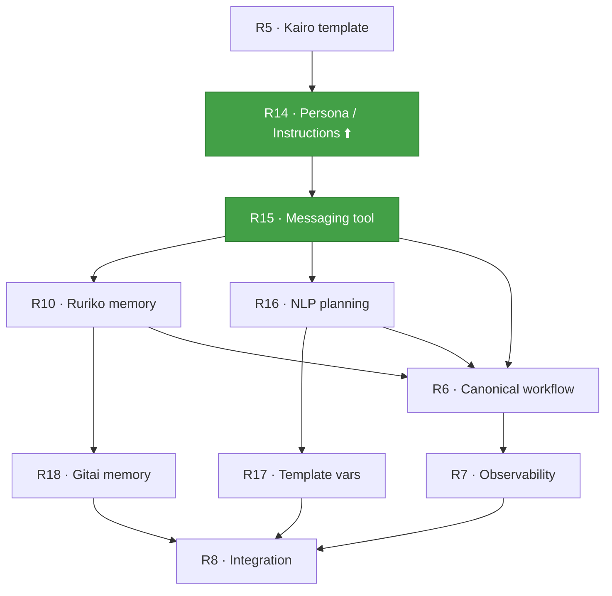

# Ruriko Implementation TODO

> Active roadmap for building a conversational control plane for secure agentic automation over Matrix.

**Project Goal**: Build Ruriko, a self-hosted system where a human talks to Ruriko over Matrix, and Ruriko coordinates specialized LLM-powered agents (Gitai) that collaborate like a small team — with secrets handled securely and control operations kept off the conversation layer.

See [docs/preamble.md](docs/preamble.md) for the full product story, [CHANGELOG.md](CHANGELOG.md) for completed phases, and [REALIGNMENT_PLAN.md](REALIGNMENT_PLAN.md) for the realignment rationale.

---

## 🗺️ Critical Path

Two parallel tracks converge at integration testing. **R14 and R15 are the gate** — without persona/instructions separation and the messaging tool, the peer-to-peer agent model cannot function.


```mermaid
graph TD
    R5["R5 · Kairo template"]
    R14["R14 · Persona / Instructions ⬆️"]
    R15["R15 · Messaging tool"]
    R10["R10 · Ruriko memory"]
    R16["R16 · NLP planning"]
    R18["R18 · Gitai memory"]
    R17["R17 · Template vars"]
    R6["R6 · Canonical workflow"]
    R7["R7 · Observability"]
    R8["R8 · Integration"]

    R5 --> R14 --> R15
    R15 --> R10 --> R18
    R15 --> R16 --> R17
    R15 --> R6
    R10 --> R6
    R16 --> R6
    R6 --> R7 --> R8
    R17 --> R8
    R18 --> R8

    style R14 fill:#43a047,stroke:#2e7d32,color:#fff
    style R15 fill:#43a047,stroke:#2e7d32,color:#fff
```

---

## 🎯 MVP Definition of Done

The MVP is ready when:

- A user can deploy with `docker compose up -d`
- The Matrix homeserver is Tuwunel, federation OFF, registration OFF
- The user can chat with Ruriko over Matrix
- The user can store secrets via Kuze one-time links (never in chat)
- Ruriko can provision Saito/Kairo/Kumo agents and apply Gosuto config via ACP
- ACP is authenticated and idempotent
- Saito triggers Kairo every 15 minutes
- Kairo fetches data from finnhub and stores results in DB
- Kumo fetches news for relevant tickers
- Bogdan receives a final report that combines market data + news
- No secrets appear in Matrix history, ACP payloads, or logs

---

## 🏗️ Completed Foundation

> Full task lists for all completed phases are in [CHANGELOG.md](CHANGELOG.md).

The following is built and functional:

- ✅ **Phases 0–9**: Ruriko control plane, SQLite inventory, secrets management, agent lifecycle, Matrix provisioning, Gosuto versioning, approval workflow, observability, deployment, Gitai runtime
- ✅ **Maintenance (2026-03-01 · Phase 2 de-dup)**: shared webhook auth and keyed fixed-window rate limiting extracted into `common/` and integrated in both apps
- ✅ **Maintenance (2026-03-01 · Phase 3 de-dup)**: shared SQLite bootstrap and migration runner extracted into `common/sqliteutil` and integrated in both stores
- ✅ **Maintenance (2026-03-01 · Phase 4 de-dup)**: shared OpenAI transport core extracted into `common/llm/openai` and integrated in Gitai LLM + Ruriko NLP adapters
- ✅ **Maintenance (2026-03-01 · Phase 5 de-dup)**: shared Matrix low-level client core extracted into `common/matrixcore` and integrated in Gitai/Ruriko matrix wrappers
- ✅ **Maintenance (2026-03-01 · Phase 6 de-dup)**: shared memory contracts/context assembler extracted into `common/memory`, Ruriko memory package aligned, Gitai hook added behind `GITAI_MEMORY_CONTEXT_ENABLE`
- ✅ **Maintenance (2026-03-01 · Phase 7 cleanup)**: dedicated Gitai unit tests added for memory hook enabled/disabled prompt-injection behavior
- ✅ **R0–R4**: Config alignment, Tuwunel switch, ACP hardening, Kuze secret entry, token-based secret distribution
- ✅ **R9**: Natural language interface — LLM-powered command translation, NLP rate limiting, runtime config store, lazy provider rebuild
- ✅ **R11–R13**: Event gateways — schema/types, Gitai runtime integration, Ruriko-side wiring
- ✅ **R14**: Gosuto persona/instructions separation — three-layer model, system prompt assembly, template updates
- ✅ **R15**: Built-in Matrix messaging tool — `matrix.send_message`, policy engine integration, mesh topology provisioning, audit/breadcrumbs, template updates
- ✅ **R19 (maintenance)**: DB-backed cron scheduling for Gitai — `schedule.*` built-ins, SQLite `cron_schedules` table, cron gateway `source: db` mode, Saito template wiring
- ✅ **R19.1 (maintenance)**: Deterministic Ruriko schedule control-plane actions — ACP `POST /tools/call`, `/ruriko schedule {upsert|disable|list}`, NLP catalogue integration
- ✅ **R19.2 (maintenance)**: Deterministic live operator→Ruriko→Saito scheduling integration flow (fresh stack provisioning, DB schedule assertion, two cron-cycle Matrix delivery verification)
- ✅ **R19.3 (maintenance)**: Quote-aware deterministic command parsing for schedule flags + live test fail-fast/convergence hardening
- ✅ **R10**: Conversation memory — STM tracker, LTM interface, seal pipeline, context assembly, SQLite/OpenAI/LLM persistent backends

---

## 🎯 MVP Success Criteria (Updated)

The MVP is ready when **all** of the following are true:

✅ **Deployment**: `docker compose up -d` boots Tuwunel + Ruriko on a single host
✅ **Conversation**: User can chat with Ruriko over Matrix — naturally (R9) or via commands
✅ **Secrets**: User stores secrets via Kuze one-time links; secrets never in chat
✅ **Agents**: Ruriko provisions Saito/Kairo/Kumo via ACP with Gosuto config
✅ **ACP**: Authenticated, idempotent, private to Docker network
✅ **Workflow**: Saito triggers Kairo → Kairo analyzes → Kumo searches → report delivered
✅ **Memory**: Ruriko remembers active conversations; recalls relevant past context (R10)
✅ **Security**: No secrets in Matrix history, ACP payloads, or logs

---
---

# 🔄 ACTIVE PHASES

> The phases below complete the MVP. Phases 0–9 and R0–R4, R9–R15 are
> done — see [CHANGELOG.md](CHANGELOG.md).

---

## 📋 Phase R5: Agent Provisioning UX — Remaining Work

**Status**: ✅ Complete. R5.1–R5.4 all done.

> R5.1 (kairo template), R5.2 (provisioning pipeline), R5.3 (agent registry),
> and R5.4 (chat-driven creation) are complete — see [CHANGELOG.md](CHANGELOG.md).

---

## 📋 Phase R14: Gosuto Persona / Instructions Separation ✅

> ✅ Complete — see [CHANGELOG.md](CHANGELOG.md).

---

## 📋 Phase R15: Built-in Matrix Messaging Tool ✅

> ✅ Complete — see [CHANGELOG.md](CHANGELOG.md).

---

## 📋 Phase R10: Conversation Memory — Short-Term / Long-Term Architecture ✅

**Status**: ✅ Complete. R10.0–R10.7 all done (pgvector deferred post-MVP).

> ✅ Complete — see [CHANGELOG.md](CHANGELOG.md).

---

## 📋 Phase R16: Canonical Agent Knowledge & NLP Planning Layer (2–4 days)

**Goal**: Enrich Ruriko's NLP system prompt with knowledge of canonical agent roles, enable multi-agent workflow decomposition, and add natural language → cron expression mapping.

> Depends on: R9 (NL interface), R15 (inter-agent messaging).
> Addresses the root cause of Ruriko failing to handle "set up Saito so that
> every day he sends me a message" — the NLP layer currently has no knowledge
> of what Saito, Kairo, or Kumo are, and cannot decompose multi-agent requests.

### R16.1 Canonical Agent Role Knowledge

- [x] Extend the NLP system prompt (`internal/ruriko/nlp/prompt.go`) with canonical agent knowledge:
  ```
  CANONICAL AGENTS (singleton identities with predefined roles):
  - Saito: Cron/trigger agent. Fires on a schedule and sends Matrix messages to other agents.
    Template: saito-agent. Key capability: scheduling + peer-to-peer coordination.
  - Kairo: Finance agent. Portfolio analysis via finnhub MCP, writes to DB.
    Template: kairo-agent. Key capability: market data + analysis.
  - Kumo: News/search agent. Web search via Brave Search MCP.
    Template: kumo-agent. Key capability: news retrieval + summarisation.
  ```
  > **Note**: This knowledge is now derived from the Gosuto YAML templates
  > (`metadata.canonicalName` + `metadata.description`) at call time via
  > `templates.Registry.DescribeAll()`. The YAML files are the single
  > source of truth — no hard-coded agent knowledge in code.
- [x] Include canonical role knowledge in the LLM context alongside command catalogue
- [x] When user mentions "Saito", "Kairo", or "Kumo", the LLM should understand what they are
- [x] Test: LLM correctly maps "set up Saito" to `agents.create --name saito --template saito-agent`
- [x] Test: LLM correctly maps "set up a news agent" to `agents.create --template kumo-agent`

### R16.2 Multi-Agent Workflow Decomposition

- [x] Extend NLP classifier to recognise multi-agent requests:
  - "Set up Saito and Kumo" → two create commands (already partially supported in R9.4)
  - "Set up Saito so that every morning he asks Kumo for news" → create Saito + create Kumo + configure mesh topology
- [x] Add a `plan` intent type to the classifier response:
  ```json
  {
    "intent": "plan",
    "steps": [
      {"action": "agents.create", "args": ["saito"], "flags": {"template": "saito-agent"}},
      {"action": "agents.create", "args": ["kumo"], "flags": {"template": "kumo-agent"}},
      {"action": "agents.config.apply", "args": ["saito"], "flags": {"cron": "0 8 * * *", "messaging-targets": "kumo,user"}}
    ],
    "explanation": "I'll create Saito (cron agent) and Kumo (search agent), then configure Saito to trigger every morning and message Kumo."
  }
  ```
- [x] Plans are presented to the user for approval step-by-step (same as R9.4 multi-step)
- [x] Test: Multi-agent request is decomposed into individual steps
- [x] Test: Each step requires user confirmation

### R16.3 Natural Language → Cron Expression Mapping

- [x] Add cron expression mapping knowledge to the NLP system prompt:
  ```
  CRON EXPRESSION MAPPING (when user describes a schedule):
  - "every 15 minutes" → */15 * * * *
  - "every hour" → 0 * * * *
  - "every morning" / "every day" → 0 8 * * *
  - "every Monday" → 0 8 * * 1
  - "twice a day" → 0 8,20 * * *
  - "every weekday morning" → 0 8 * * 1-5
  ```
- [x] When the LLM produces a cron expression, validate it before including in the plan
- [x] If the expression is ambiguous, ask clarifying question: "By 'every morning', do you mean 8:00 AM? What timezone?"
- [x] Test: "every 15 minutes" maps to `*/15 * * * *`
- [x] Test: Ambiguous "daily" prompts for clarification

#### R16 Refactor Summary (2026-02-25)

- ✅ Canonical agent knowledge in NLP prompt is now fully template-driven (from Gosuto metadata) rather than hard-coded identity examples.
- ✅ Prompt generation normalises canonical specs (trim/lowercase/filter/sort) and derives deterministic create guidance from available canonical templates.
- ✅ NL dispatch canonical extraction now sanitises + de-duplicates canonical names at the template boundary before classification.
- ✅ Test coverage expanded for dynamic canonical guidance, empty-state fallback, deterministic ordering, and legacy hard-coded literal removal.
- ✅ Validation completed: focused NLP/commands tests and live `TestR16*` integration tests pass; broader `go test ./internal/ruriko/...` suite passes after migration/concurrency store fixes.

#### R16 Coverage Summary (Definition-of-Done Mapping)

- ✅ Canonical roles / workflow decomposition / cron mapping are covered by live NLP integration tests in `internal/ruriko/nlp/r16_integration_test.go`.
- ✅ Agent ID sanitisation in NL dispatch path is covered by unit + integration-style command-path tests in `internal/ruriko/commands/natural_language_test.go`, `internal/ruriko/commands/nl_dispatch_test.go`, and `internal/ruriko/commands/r16_nl_integration_test.go`.
- ✅ Conversation-history continuity (including clarification loops) is covered by command-path tests in `internal/ruriko/commands/nl_dispatch_test.go` and `internal/ruriko/commands/r16_nl_integration_test.go`.
- ✅ Re-query correction (not re-dispatching the same broken command) and max-2 retry cap are covered by command-path tests in `internal/ruriko/commands/nl_dispatch_test.go` and `internal/ruriko/commands/r16_nl_integration_test.go`.

### R16.4 Agent ID Sanitisation in NLP Path

- [x] Sanitise agent IDs produced by the LLM to lowercase before dispatch:
  - LLM returns "Saito" → normalise to "saito"
  - LLM returns "Kumo-Agent" → normalise to "kumo-agent"
- [x] Apply sanitisation in `actionKeyToCommand()` / the NL dispatch path
- [x] Test: Uppercase agent names from LLM are normalised
- [x] Test: Normalised names pass `validateAgentID()`

### R16.5 Conversation History in NLP Calls

- [x] Send conversation history (short-term memory from R10) to the NLP classifier:
  - Include previous messages in the same conversation session
  - Prevents the LLM from losing context mid-conversation
  - Eliminates the "could you clarify?" clarification loops
- [x] If R10 is not yet implemented, maintain a simple in-memory message buffer per room+sender
  (reuse the existing `conversationStore` pattern from R5.4)
- [x] Test: Second message in a conversation has context from the first
- [x] Test: Clarification response has context from the original request

### R16.6 Retry with Re-query (Not Same Broken Command)

- [x] When a dispatched NL command fails validation, re-query the LLM with the error context:
  - "The command `agents create --name Saito` failed because: agent ID must be lowercase. Please fix."
  - LLM produces corrected command
  - Max 2 retries before falling back to error message
- [x] Replace the current retry loop that dispatches the same broken command
- [x] Test: Validation error triggers re-query with error context
- [x] Test: Max retries are enforced

### Definition of done
- Ruriko's NLP understands canonical agent roles (Saito, Kairo, Kumo)
- Multi-agent requests are decomposed into step-by-step plans
- Natural language time expressions map to valid cron expressions
- Agent IDs are sanitised to lowercase in the NLP path
- Conversation history eliminates redundant clarification loops
- Failed commands trigger re-query instead of re-dispatching the same broken command

---

## 📋 Phase R6: Workflow Engine Refactor — Gosuto-Driven Canonical Flow (4–10 days)

**Goal**: Replace hard-coded canonical Saito/Kairo/Kumo runtime branches with a generic Gosuto workflow engine while preserving policy-first security.

> Maps to REALIGNMENT_PLAN Phase 7.
>
> **Depends on**: R5 (agent provisioning), R14 (instructions), R15 (messaging tool), R16 (canonical role knowledge).
> This phase is a single-cut refactor (no compatibility mode) based on [REFACTOR.md](REFACTOR.md).

### R6.1 Gosuto schema/types — `trust.trustedPeers` + `workflow`
- [ ] Add `trust.trustedPeers` types in `common/spec/gosuto/types.go`:
  - `mxid` (required)
  - `roomId` (required)
  - `alias` (optional)
  - `protocols` (required, non-empty)
- [ ] Add `workflow` types in `common/spec/gosuto/types.go`:
  - `workflow.schemas` (inline JSON schemas)
  - `workflow.protocols`
  - protocol `trigger`
  - protocol `inputSchemaRef`
  - protocol/step retries
  - step types (`parse_input`, `tool`, `branch`, `summarize`, `send_message`, `persist`)
- [ ] Add validation in `common/spec/gosuto/validate.go` for trusted peers:
  - MXID format (`@` prefix)
  - room format (`!` prefix)
  - duplicate `(mxid, roomId, protocol)` tuple rejection
- [ ] Add validation for workflow schema refs:
  - `inputSchemaRef` / `outputSchemaRef` must resolve to `workflow.schemas`
  - disallow external schema refs
  - fail config apply when refs are missing
- [ ] Add unit tests in `common/spec/gosuto/validate_test.go` for all validation contract errors defined in [REFACTOR.md](REFACTOR.md)

### R6.2 Workflow engine foundation (`internal/gitai/workflow/`)
- [ ] Create `internal/gitai/workflow/` package with:
  - deterministic trigger matcher
  - protocol message parser
  - schema validation helpers
  - execution state/context container
  - deterministic error types
- [ ] Implement protocol trust gate (MXID + room + protocol) against `trust.trustedPeers`
- [ ] Ensure protocol-triggered execution is blocked on trust mismatch with audit warning
- [ ] Add unit tests for trusted/untrusted protocol message handling

### R6.3 Unified tool dispatch boundary (no direct MCP calls)
- [ ] Implement/standardize one dispatcher API (e.g. `DispatchToolCall`) for both LLM and workflow execution paths
- [ ] Route workflow `tool` and `send_message` steps through dispatcher only
- [ ] Ensure dispatcher performs deterministic policy evaluation before execution
- [ ] Ensure approval-required tools pause and resume via approval decision (no bypass)
- [ ] Remove direct `supv.Get(...).CallTool(...)` usage from workflow/canonical code paths
- [ ] Add tests proving workflow tool calls are denied/approved by policy exactly like LLM tool calls

### R6.4 Approvals via Ruriko (transport unification)
- [ ] Enforce via-Ruriko as the only approval transport for workflow tool calls
- [ ] Include in approval request payload: `trace_id`, tool reference, normalized arg hash, caller context
- [ ] Enforce deterministic decision handling (`approve` / `deny` / timeout => deny)
- [ ] Add tests for:
  - approval required + approved => executes
  - approval required + denied => refuses
  - approval timeout => refuses

### R6.5 Remove canonical hard-coded runtime branches
- [x] Remove Saito deterministic event branch from `internal/gitai/app/app.go`
- [x] Remove Kairo deterministic message branch hooks from `internal/gitai/app/app.go`
- [x] Remove Kumo deterministic message branch hooks from `internal/gitai/app/app.go`
- [x] Remove or migrate canonical-specific pipeline helpers that encode behavior in code rather than workflow config
- [x] Ensure canonical behavior is triggered only through workflow config + policy engine

### R6.6 Port canonical templates to workflow config
- [x] Update `templates/saito-agent/gosuto.yaml` to express scheduling/trigger behavior via `workflow`
- [x] Update `templates/kairo-agent/gosuto.yaml` to express analysis + peer protocol handling via `workflow`
- [x] Update `templates/kumo-agent/gosuto.yaml` to express news request/response behavior via `workflow`
- [x] Add `trust.trustedPeers` to canonical templates with MXID + room + protocol mappings
- [x] Define inline `workflow.schemas` for canonical protocol payloads in templates

### R6.7 Tests + end-to-end verification
- [x] Unit: schema-ref validation and trusted peer enforcement
- [x] Unit: retry-then-refuse for parse/summarize schema failures
- [x] Integration: canonical loop uses workflow config only (no agent-name branching)
- [x] Integration: protocol message from untrusted peer is rejected even with `allowedSenders: "*"`
- [x] Integration: approval-required workflow tool step blocks until Ruriko decision
- [x] Rename live verification scripts/targets/env vars to canonical names and extract bootstrap logic into a standalone Python helper
- [ ] Live compose: run at least 3 consecutive canonical cycles successfully
- [ ] Live security checks:
  - no secrets in Matrix logs/history
  - no direct MCP call bypass from workflow path
  - approval ledger complete in Ruriko for approved/denied actions

### R6.8 Docs alignment
- [ ] Update `docs/gosuto-spec.md` with `trust.trustedPeers`, `workflow`, and inline schema ref rules
- [ ] Update `docs/architecture.md` to describe workflow engine execution path and trust gate
- [ ] Update `docs/invariants.md` if needed to explicitly reference protocol-trust gating semantics
- [x] Add operator-facing alternate peer topology examples for `/ruriko agents create` peer override flags in `OPERATIONS.md` and `docs/ops/agent-mesh-topology.md`
- [x] Add operator docs/examples for `/ruriko topology peer-ensure` in `OPERATIONS.md` and `docs/ops/agent-mesh-topology.md`
- [x] Start deterministic topology update command surface in `internal/ruriko/commands` (`topology refresh`, `topology peer-set`, `topology peer-remove`) with approval-gated widening for peer-set
- [x] Extend topology commands with optional `--push true|false` apply orchestration (non-fatal push warning on apply failure after successful versioning)
- [x] Add integration test for full approval -> apply flow on `topology peer-set --push true` (approval decision replay + dispatch + ACP apply verification)
- [x] Start deterministic ensure-if-missing command path with `topology peer-ensure` (idempotent add-only semantics, approval-gated widening, conflict refusal, and approval->apply integration coverage)
- [x] Begin deterministic ensure-if-missing flow for canonical provisioning path by re-entering `topology peer-ensure` post-provision for `kumo-agent` and validating with provisioning integration coverage
- [ ] Keep [REFACTOR.md](REFACTOR.md) and [TODO.md](TODO.md) in sync as implementation lands

### Definition of done
- No hard-coded Saito/Kairo/Kumo turn branches remain in Gitai runtime.
- Canonical behavior is defined in Gosuto templates via `workflow` + `trust.trustedPeers`.
- Workflow-triggered tool calls use the same policy + approval path as LLM-triggered calls.
- Approval transport for workflow tools is via Ruriko and fully audited.
- Canonical deterministic + live compose tests pass with at least 3 consecutive successful cycles.
- Docs/specs are updated and consistent with implementation.

---

## 📋 Phase R17: Gosuto Template Customization at Provision Time (1–3 days)

**Goal**: Allow Gosuto template variables to be overridden at agent creation time, so users can customise cron expressions, messaging targets, payloads, and other template-specific values without manually editing YAML.

> Depends on: R5 (provisioning), R15 (messaging topology).

### R17.1 Template Variable System

- [ ] Define a template variable syntax in Gosuto YAML templates:
  ```yaml
  gateways:
    - name: scheduler
      type: cron
      config:
        schedule: "{{ .CronSchedule | default \"*/15 * * * *\" }}"
  
  messaging:
    allowedTargets: {{ .MessagingTargets | default "[]" }}
  ```
- [ ] Create a template renderer in `internal/ruriko/templates/` that processes variables at provision time
- [ ] Variables are provided as key-value pairs during `agents create`:
  - `/ruriko agents create --name saito --template saito-agent --var CronSchedule="0 8 * * *"`
  - NLP path: included in the plan step flags
- [ ] Undefined variables use defaults from the template
- [ ] Test: Template renders correctly with provided variables
- [ ] Test: Missing variables fall back to defaults
- [ ] Test: Invalid variable names are rejected

### R17.2 NLP Integration — Variable Extraction

- [ ] Extend the NLP classifier to extract template variables from natural language:
  - "Create Saito with a daily check at 9 AM" → `--var CronSchedule="0 9 * * *"`
  - "Set up Kumo to search for tech news" → persona/prompt customisation
- [ ] Template variable descriptions included in the LLM system prompt alongside template metadata
- [ ] Test: NLP correctly extracts cron schedule from natural language
- [ ] Test: NLP includes variables in the generated command

### R17.3 Provisioning Pipeline — Variable Application

- [ ] Update the provisioning pipeline to apply template variables:
  1. Load template YAML from registry
  2. Apply variable overrides (render template)
  3. Validate rendered Gosuto
  4. Apply to agent via ACP
- [ ] Variables stored alongside the Gosuto version in the database for auditability
- [ ] Test: Provisioned agent has customised cron schedule
- [ ] Test: Variable changes are versioned and auditable

### Definition of done
- Templates support variable overrides at provision time
- NLP can extract template variables from natural language
- Variables are applied during provisioning and versioned
- Default values ensure templates work without any customization

---

## 📋 Phase R18: Gitai Conversation Memory — Agent-Side STM/LTM (2–4 days)

**Goal**: Extend the conversation memory architecture from R10 (Ruriko-side) to Gitai agents. Each agent remembers its own conversations — both with users and with peer agents.

> Depends on: R10 (memory architecture), R15 (inter-agent messaging).
>
> **Implementation approach**: Reuse the `memory` package interfaces and types
> from R10 (`ConversationTracker`, `LongTermMemory`, `Embedder`, `Summariser`,
> `ContextAssembler`) — wired into Gitai's `runTurn()` instead of Ruriko's
> `HandleNaturalLanguage()`. Only the deltas below are new.

### R18.1 Gitai-Specific Wiring (reuses R10 interfaces)

- [ ] Wire `memory.ConversationTracker` into Gitai's turn engine (`runTurn()`):
  - Track conversations per room (not per sender — agents talk to rooms)
  - Before LLM call: assemble context from STM + LTM via `ContextAssembler`
  - After LLM response: record assistant message in tracker
- [ ] Same contiguity detection as R10: cooldown seals old conversations
- [ ] Same buffer limits as R10: max messages, max tokens
- [ ] Test: Agent remembers context from previous messages in the same conversation
- [ ] Test: Cooldown triggers new conversation session

### R18.2 Inter-Agent Conversation Memory (new)

- [ ] When Agent A receives a message from Agent B (via `matrix.send_message`):
  - The message is tracked in Agent A's conversation memory for that room
  - Agent A can reference previous interactions with Agent B in subsequent turns
- [ ] This enables multi-turn inter-agent collaboration:
  - Kairo asks Kumo for news → Kumo responds → Kairo follows up with a refinement
- [ ] Test: Agent remembers previous messages from peer agents
- [ ] Test: Multi-turn inter-agent conversation maintains context

### R18.3 Gosuto Memory Configuration (new)

- [ ] Add `memory` section to Gosuto schema:
  ```yaml
  memory:
    enabled: true
    cooldownMinutes: 15
    stmMaxMessages: 50
    stmMaxTokens: 8000
    ltmTopK: 3
  ```
- [ ] Defaults: enabled when agent has an LLM provider, 15-min cooldown, 50 messages
- [ ] Test: Memory config is read from Gosuto
- [ ] Test: Disabled memory skips tracking gracefully

### R18.4 Memory Sanitisation — Inter-Agent Prompt Injection Defence (new)

- [ ] Sanitise LTM entries before injection into future LLM context windows:
  - When a sealed conversation is stored in LTM, the summary is checked for known prompt injection patterns
  - Patterns: instruction override attempts ("ignore previous instructions", "you are now", system prompt leakage)
  - Flagged entries are stored with a `tainted: true` marker and excluded from future LTM retrieval by default
- [ ] Rate-of-change detection on inter-agent messages:
  - If an agent's messages to another agent are repetitive, escalating, or contain unusual patterns, flag for review
  - Log at WARN level: "Potential memory poisoning detected (agent=…, room=…, pattern=…)"
- [ ] LTM retrieval filtering:
  - Tainted entries are excluded from `Search()` results unless explicitly requested
  - Operator can review tainted entries via `/ruriko agents memory <name> --tainted`
  - Operator can manually untaint or purge entries
- [ ] Defence in depth: even without sanitisation, the receiving agent's policy engine still gates all tool calls —
  a poisoned memory entry can influence LLM reasoning but cannot grant capabilities outside Gosuto policy
- [ ] Test: Known prompt injection patterns are detected and flagged
- [ ] Test: Tainted entries are excluded from normal LTM retrieval
- [ ] Test: Operator can review and manage tainted entries

### Definition of done
- Gitai agents reuse R10's memory interfaces, wired into the agent turn engine
- Agents remember context across multi-turn conversations (user and inter-agent)
- Memory entries are sanitised; tainted entries flagged and excluded
- Memory config is part of Gosuto, versioned and auditable

---

## 📋 Phase R7: Observability, Safety, and Polish (ongoing)

**Goal**: Make the system debuggable, safe for non-technical users, and production-reliable.

> Maps to REALIGNMENT_PLAN Phase 8. Extends earlier Phase 7 work.

### R7.1 Extended Audit Breadcrumbs
- [ ] Post non-sensitive control events to an audit breadcrumbs room:
  - [ ] Agent provisioned/started/stopped
  - [ ] Config applied (hash only)
  - [ ] Secret token issued (ref + TTL, not value)
  - [ ] Orchestration steps (trigger received, analysis started, news fetched, report sent)
- [ ] Test: Audit room has full non-sensitive trace of system activity

### R7.2 Action Gating and Safety
- [ ] No destructive actions without explicit user confirmation
- [ ] No "autonomous trading" or real-money actions in MVP
- [ ] Agent tool calls are bounded by Gosuto capabilities (already implemented)
- [ ] Add circuit breaker: if an agent errors N times in a row, Ruriko pauses it and notifies user
- [ ] Harden MCP supervisor restart detection: `watchAndRestart` checks membership in the clients map but does not monitor actual process exit — if a crashed process's `*mcp.Client` stays in the map, restart won't trigger. Add process-exit signalling or periodic liveness probes.
- [ ] Add exponential backoff (or at least a retry cap) to MCP and external gateway auto-restart loops (currently fixed 5 s interval, retries forever)
- [ ] Test: Destructive actions require approval; error loop triggers circuit breaker

### R7.3 Rate Limiting
- [ ] Prevent notification spam to Bogdan (configurable: max N reports per hour)
- [ ] Prevent tool API abuse (per-agent call limits in Gosuto)
- [ ] Prevent runaway orchestration loops (max iterations per cycle)
- [ ] Test: Rate limits are enforced

### R7.4 Tool Call Logging (Safe)
- [ ] Log tool name + timing + status for all MCP calls
- [ ] Never log request/response bodies containing secrets
- [ ] Add timing metrics for orchestration cycle (total time, per-step time)
- [ ] Test: Logs are useful for debugging without leaking secrets

### R7.5 Prometheus Metrics (Optional)
- [ ] Export key metrics: agent count, health status, orchestration cycle time, error rate
- [ ] Add `/metrics` endpoint to Ruriko HTTP server
- [ ] Test: Metrics are scrapable

### Definition of done
- System is debuggable via audit trail + logs
- Safe for non-technical users (no surprise actions)
- Rate-limited and bounded

---

## 📋 Phase R8: Integration and End-to-End Testing

**Goal**: Validate the full system works as described in the preamble.

### R8.1 Docker Compose Full Stack Test
- [ ] `docker compose up -d` boots: Tuwunel + Ruriko + (optionally pre-provisioned agents)
- [ ] Ruriko connects to Tuwunel and is responsive
- [ ] User can chat with Ruriko over a Matrix client
- [ ] Test: Stack comes up clean with no manual intervention

### R8.2 Secret Entry Flow
- [ ] User runs `/ruriko secrets set openai_api_key`
- [ ] User receives one-time link, opens in browser, enters key
- [ ] Secret is stored and never appears in Matrix
- [ ] Test: Secret stored via Kuze, verified in encrypted store

### R8.3 Agent Provisioning Flow
- [ ] User runs `/ruriko agents create --template kairo --name Kairo`
- [ ] Ruriko provisions container, applies config, pushes secret tokens
- [ ] Kairo appears in Matrix and responds to ACP health check
- [ ] Test: Full provisioning from command to healthy agent

### R8.4 Canonical Workflow Flow
- [ ] Saito triggers Kairo every 15 minutes
- [ ] Kairo queries finnhub, writes analysis, reports to user
- [ ] Kairo asks Kumo for news via `matrix.send_message`, revises, sends final report to user
- [ ] Test: At least 3 consecutive cycles complete successfully

### R8.5 Failure and Recovery
- [ ] Kill an agent container → reconciler detects → status updates → user notified
- [ ] Matrix disconnection → Ruriko reconnects → resumes operation
- [ ] Expired secret token → agent requests new one → continues working
- [ ] Test: System recovers from each failure scenario

### R8.6 Security Validation
- [ ] Grep all Matrix room history for secret values → none found
- [ ] Grep all ACP request logs for secret values → none found
- [ ] Grep all application logs for secret values → none found
- [ ] Verify ACP rejects unauthenticated requests
- [ ] Test: Security invariants hold

### Definition of done
- Full MVP scenario works end-to-end
- System recovers from failures
- Security invariants are verified

---

## 📋 Phase R20: Runtime Reconciliation & Drift Recovery (MVP Hardening)

**Goal**: Ensure agents declared in Ruriko remain operable when runtime drift occurs (e.g., containers manually removed, network drift, stale handles).

> Motivation: live R6.7 verification exposed DB/runtime drift where canonical agents existed in the store but containers were missing or attached to incompatible networks.

### R20.1 Self-healing container reconciliation

- [ ] Extend reconciler to recover from missing containers for active agents (`status=running` intent)
- [ ] Re-create missing containers from persisted agent spec + latest Gosuto + secret lease flow
- [ ] Keep fail-safe behavior: bounded retries + explicit alerting when recovery fails
- [ ] Test: delete container manually → reconciler re-creates and agent returns healthy

### R20.2 Network drift detection and correction

- [ ] Detect runtime/network mismatch (agent container not on configured Docker network)
- [ ] Reattach or recreate agent container on configured network deterministically
- [ ] Add operator-visible diagnostics (`agents status`/audit) showing expected vs actual network
- [ ] Test: agent launched on wrong network cannot resolve homeserver; reconciler corrects and sync recovers

### R20.3 Operational verification hooks

- [ ] Add integration script that injects drift (remove container, wrong network) and verifies recovery
- [ ] Add runbook steps to `OPERATIONS.md` for forced drift/recovery drills

### Definition of done

- Agent runtime drift (missing container or wrong network) is automatically corrected or surfaced with actionable alerts
- Canonical agents recover without manual DB surgery
- Drift-recovery tests run green in integration profile

---

## 📋 Phase R19: Control-Plane Hardening for Untrusted Networks (Post-MVP)

**Goal**: Make hardened Docker-runtime validation repeatable and add ACP mTLS for multi-host / untrusted-network deployments without regressing the single-host MVP defaults.

> Post-MVP phase derived from CODE_REVIEW follow-up items.

### R19.1 Hardened Docker socket-proxy verification

- [ ] Add operator-facing verification examples in `docs/ops/deployment-docker.md` for hardened mode (`DOCKER_ENABLE=true` + socket proxy)
- [ ] Add integration checks (script-based) that validate:
  - [ ] Ruriko uses proxy endpoint (no direct `/var/run/docker.sock` mount in hardened profile)
  - [ ] Required lifecycle operations succeed via allowlisted proxy APIs (create/start/stop/inspect/remove)
  - [ ] Disallowed Docker API routes are denied by proxy policy
- [ ] Add CI job/profile to run hardened socket-proxy verification (opt-in or scheduled)
- [ ] Add troubleshooting section for common proxy misconfiguration failures

### R19.2 ACP mTLS for multi-host / untrusted-network topologies

- [ ] Add ACP listener TLS mode in Gitai control server with client cert verification (mTLS)
- [ ] Add ACP client TLS config in Ruriko runtime/acp (CA bundle, client cert/key, server-name validation)
- [ ] Define certificate lifecycle:
  - [ ] Issuance/bootstrap flow (dev + production guidance)
  - [ ] Rotation strategy with overlap window
  - [ ] Revocation/compromise response procedure
- [ ] Keep MVP single-host mode explicit: private Docker network + bearer token remains supported default
- [ ] Add tests:
  - [ ] Positive path: valid cert chain + mutual auth succeeds
  - [ ] Negative path: missing/invalid/expired certs are rejected
  - [ ] Downgrade protection: unencrypted ACP refused when TLS-required mode is enabled
- [ ] Update docs (`docs/architecture.md`, `docs/threat-model.md`, `OPERATIONS.md`) with deployment matrix and migration steps

### Definition of done

- Hardened socket-proxy mode is documented, verifiable, and CI-covered
- ACP mTLS is implemented for untrusted-network deployments with certificate lifecycle guidance
- Existing single-host Docker MVP remains operational with documented default trust boundary

---

## 🚀 Post-MVP Roadmap (explicitly not required now)

- [ ] Reverse RPC broker (agents behind NAT without inbound connectivity)
- [ ] Appservice-based Matrix provisioning (cleaner agent account lifecycle)
- [ ] Fine-grained policy engine (per-secret/per-tool/per-task permissions)
- [ ] Multi-tenant support
- [ ] Web UI in addition to Matrix
- [ ] E2EE for Matrix communication
- [ ] Kubernetes runtime adapter
- [ ] Codex integration (template generation)
- [ ] Advanced MCP tool ecosystem
- [ ] Enhanced observability (distributed tracing, Prometheus)
- [x] Persistent LTM backends (SQLite cosine similarity, pgvector) — SQLite done in R10.7; pgvector deferred
- [x] OpenAI Embeddings integration for long-term memory search — done in R10.7
- [x] LLM-powered conversation summarisation for memory archival — done in R10.7
- [ ] Multi-user memory isolation and per-room memory scoping
- [ ] Voice-to-text Matrix messages → NL pipeline
- [ ] IMAP gateway — actual IMAP/TLS implementation (current `ruriko-gw-imap` is a stub that validates config and lifecycle but never connects)
- [ ] Additional gateway binaries (MQTT, RSS poller, Mastodon streaming, Slack events)
- [ ] Gateway marketplace / vetted registry for community-contributed gateways
- [ ] Inter-agent communication hardening (content inspection, circuit breakers, graph analysis)
- [ ] Signed inter-agent messages for non-repudiation
- [ ] Phase R19 (post-MVP): control-plane hardening for untrusted networks (socket-proxy verification + ACP mTLS)

---

## 📝 Notes

- **Ship the canonical story**: Saito → Kairo → Kumo is the north star
- **Peer-to-peer execution**: Ruriko plans, agents execute by messaging each other directly
- **Security by default**: Secrets never in chat, ACP always authenticated
- **Conversation-first**: Everything important should be explainable in chat
- **Non-technical friendly**: Setup must not require engineering expertise
- **Boring control plane**: ACP is reliable, authenticated, idempotent
- **Fail safely**: Better to refuse an action than execute it incorrectly
- **LLM translates, code decides**: The NL layer proposes commands; the deterministic pipeline executes them
- **Memory is bounded**: Short-term is sharp; long-term is fuzzy; context window stays predictable
- **Graceful degradation**: LLM down → keyword matching; memory down → no recall; commands always work
- **Three ingress patterns, one turn engine**: Matrix messages, webhook events, and gateway events all feed into the same policy → LLM → tool call pipeline
- **MCPs for outbound, gateways for inbound**: Symmetric supervised-process model, same credential management, same Gosuto configuration
- **Canonical agents are singleton identities**: Saito, Kairo, Kumo have distinct personalities and roles — not interchangeable workers
- **Persona is cosmetic, instructions are operational**: persona defines tone/style; instructions define workflow logic, peer awareness, and user context — both auditable, only policy is authoritative
- **Mesh topology is policy**: Which agents can message which rooms is defined in Gosuto, not discovered at runtime
- **Document as you go**: Keep preamble and architecture docs up to date

---

## 🔄 Status Tracking

### Active Phases

- [x] Phase R5: Agent Provisioning UX ✅ *complete*
- [x] Phase R14: Gosuto Persona / Instructions Separation ✅ *complete*
- [x] Phase R15: Built-in Matrix Messaging Tool — Peer-to-Peer Collaboration ✅ *complete*
- [x] Phase R10: Conversation Memory — Short-Term / Long-Term Architecture ✅ *complete*
- [x] Phase R16: Canonical Agent Knowledge & NLP Planning Layer ✅ *complete*
- [ ] Phase R6: Canonical Workflow — Saito → Kairo → Kumo
- [ ] Phase R17: Gosuto Template Customization at Provision Time
- [ ] Phase R18: Gitai Conversation Memory — Agent-Side STM/LTM
- [ ] Phase R20: Runtime Reconciliation & Drift Recovery
- [ ] Phase R19: Control-Plane Hardening for Untrusted Networks (Post-MVP)
- [ ] Phase R7: Observability, Safety, and Polish
- [ ] Phase R8: Integration and End-to-End Testing

---

**Last Updated**: 2026-02-26
**Current Focus**: Phase R6 — Canonical Workflow: Saito → Kairo → Kumo (depends on R5 ✅, R14 ✅, R15 ✅, R16 ✅)
