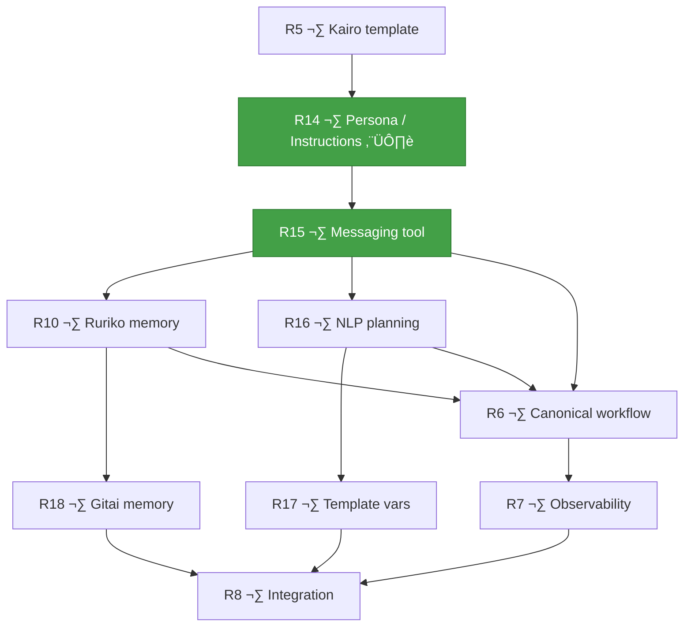

# Ruriko Implementation TODO

> Active roadmap for building a conversational control plane for secure agentic automation over Matrix.

**Project Goal**: Build Ruriko, a self-hosted system where a human talks to Ruriko over Matrix, and Ruriko coordinates specialized LLM-powered agents (Gitai) that collaborate like a small team — with secrets handled securely and control operations kept off the conversation layer.

See [docs/preamble.md](docs/preamble.md) for the full product story, [CHANGELOG.md](CHANGELOG.md) for completed phases, and [REALIGNMENT_PLAN.md](REALIGNMENT_PLAN.md) for the realignment rationale.

---

## 🗺️ Critical Path

Two parallel tracks converge at integration testing. **R14 and R15 are the gate** — without persona/instructions separation and the messaging tool, the peer-to-peer agent model cannot function.



---

## 🎯 MVP Definition of Done

The MVP is ready when:

- A user can deploy with `docker compose up -d`
- The Matrix homeserver is Tuwunel, federation OFF, registration OFF
- The user can chat with Ruriko over Matrix
- The user can store secrets via Kuze one-time links (never in chat)
- Ruriko can provision Saito/Kairo/Kumo agents and apply Gosuto config via ACP
- ACP is authenticated and idempotent
- Saito triggers Kairo every 15 minutes
- Kairo fetches data from finnhub and stores results in DB
- Kumo fetches news for relevant tickers
- Bogdan receives a final report that combines market data + news
- No secrets appear in Matrix history, ACP payloads, or logs

---

## 🏗️ Completed Foundation

> Full task lists for all completed phases are in [CHANGELOG.md](CHANGELOG.md).

The following is built and functional:

- ✅ **Phases 0–9**: Ruriko control plane, SQLite inventory, secrets management, agent lifecycle, Matrix provisioning, Gosuto versioning, approval workflow, observability, deployment, Gitai runtime
- ✅ **R0–R4**: Config alignment, Tuwunel switch, ACP hardening, Kuze secret entry, token-based secret distribution
- ✅ **R9**: Natural language interface — LLM-powered command translation, NLP rate limiting, runtime config store, lazy provider rebuild
- ✅ **R11–R13**: Event gateways — schema/types, Gitai runtime integration, Ruriko-side wiring
- ✅ **R14**: Gosuto persona/instructions separation — three-layer model, system prompt assembly, template updates
- ✅ **R15**: Built-in Matrix messaging tool — `matrix.send_message`, policy engine integration, mesh topology provisioning, audit/breadcrumbs, template updates
- ✅ **R10**: Conversation memory — STM tracker, LTM interface, seal pipeline, context assembly, SQLite/OpenAI/LLM persistent backends

---

## 🎯 MVP Success Criteria (Updated)

The MVP is ready when **all** of the following are true:

✅ **Deployment**: `docker compose up -d` boots Tuwunel + Ruriko on a single host
✅ **Conversation**: User can chat with Ruriko over Matrix — naturally (R9) or via commands
✅ **Secrets**: User stores secrets via Kuze one-time links; secrets never in chat
✅ **Agents**: Ruriko provisions Saito/Kairo/Kumo via ACP with Gosuto config
✅ **ACP**: Authenticated, idempotent, private to Docker network
✅ **Workflow**: Saito triggers Kairo → Kairo analyzes → Kumo searches → report delivered
✅ **Memory**: Ruriko remembers active conversations; recalls relevant past context (R10)
✅ **Security**: No secrets in Matrix history, ACP payloads, or logs

---
---

# 🔄 ACTIVE PHASES

> The phases below complete the MVP. Phases 0–9 and R0–R4, R9–R15 are
> done — see [CHANGELOG.md](CHANGELOG.md).

---

## 📋 Phase R5: Agent Provisioning UX — Remaining Work

**Status**: ✅ Complete. R5.1–R5.4 all done.

> R5.1 (kairo template), R5.2 (provisioning pipeline), R5.3 (agent registry),
> and R5.4 (chat-driven creation) are complete — see [CHANGELOG.md](CHANGELOG.md).

---

## 📋 Phase R14: Gosuto Persona / Instructions Separation ✅

> ✅ Complete — see [CHANGELOG.md](CHANGELOG.md).

---

## 📋 Phase R15: Built-in Matrix Messaging Tool ✅

> ✅ Complete — see [CHANGELOG.md](CHANGELOG.md).

---

## 📋 Phase R10: Conversation Memory — Short-Term / Long-Term Architecture ✅

**Status**: ✅ Complete. R10.0–R10.7 all done (pgvector deferred post-MVP).

> ✅ Complete — see [CHANGELOG.md](CHANGELOG.md).

---

## 📋 Phase R16: Canonical Agent Knowledge & NLP Planning Layer (2–4 days)

**Goal**: Enrich Ruriko's NLP system prompt with knowledge of canonical agent roles, enable multi-agent workflow decomposition, and add natural language → cron expression mapping.

> Depends on: R9 (NL interface), R15 (inter-agent messaging).
> Addresses the root cause of Ruriko failing to handle "set up Saito so that
> every day he sends me a message" — the NLP layer currently has no knowledge
> of what Saito, Kairo, or Kumo are, and cannot decompose multi-agent requests.

### R16.1 Canonical Agent Role Knowledge

- [x] Extend the NLP system prompt (`internal/ruriko/nlp/prompt.go`) with canonical agent knowledge:
  ```
  CANONICAL AGENTS (singleton identities with predefined roles):
  - Saito: Cron/trigger agent. Fires on a schedule and sends Matrix messages to other agents.
    Template: saito-agent. Key capability: scheduling + peer-to-peer coordination.
  - Kairo: Finance agent. Portfolio analysis via finnhub MCP, writes to DB.
    Template: kairo-agent. Key capability: market data + analysis.
  - Kumo: News/search agent. Web search via Brave Search MCP.
    Template: kumo-agent. Key capability: news retrieval + summarisation.
  ```
  > **Note**: This knowledge is now derived from the Gosuto YAML templates
  > (`metadata.canonicalName` + `metadata.description`) at call time via
  > `templates.Registry.DescribeAll()`. The YAML files are the single
  > source of truth — no hard-coded agent knowledge in code.
- [x] Include canonical role knowledge in the LLM context alongside command catalogue
- [x] When user mentions "Saito", "Kairo", or "Kumo", the LLM should understand what they are
- [x] Test: LLM correctly maps "set up Saito" to `agents.create --name saito --template saito-agent`
- [x] Test: LLM correctly maps "set up a news agent" to `agents.create --template kumo-agent`

### R16.2 Multi-Agent Workflow Decomposition

- [ ] Extend NLP classifier to recognise multi-agent requests:
  - "Set up Saito and Kumo" → two create commands (already partially supported in R9.4)
  - "Set up Saito so that every morning he asks Kumo for news" → create Saito + create Kumo + configure mesh topology
- [ ] Add a `plan` intent type to the classifier response:
  ```json
  {
    "intent": "plan",
    "steps": [
      {"action": "agents.create", "args": ["saito"], "flags": {"template": "saito-agent"}},
      {"action": "agents.create", "args": ["kumo"], "flags": {"template": "kumo-agent"}},
      {"action": "agents.config.apply", "args": ["saito"], "flags": {"cron": "0 8 * * *", "messaging-targets": "kumo,user"}}
    ],
    "explanation": "I'll create Saito (cron agent) and Kumo (search agent), then configure Saito to trigger every morning and message Kumo."
  }
  ```
- [ ] Plans are presented to the user for approval step-by-step (same as R9.4 multi-step)
- [ ] Test: Multi-agent request is decomposed into individual steps
- [ ] Test: Each step requires user confirmation

### R16.3 Natural Language → Cron Expression Mapping

- [ ] Add cron expression mapping knowledge to the NLP system prompt:
  ```
  CRON EXPRESSION MAPPING (when user describes a schedule):
  - "every 15 minutes" → */15 * * * *
  - "every hour" → 0 * * * *
  - "every morning" / "every day" → 0 8 * * *
  - "every Monday" → 0 8 * * 1
  - "twice a day" → 0 8,20 * * *
  - "every weekday morning" → 0 8 * * 1-5
  ```
- [ ] When the LLM produces a cron expression, validate it before including in the plan
- [ ] If the expression is ambiguous, ask clarifying question: "By 'every morning', do you mean 8:00 AM? What timezone?"
- [ ] Test: "every 15 minutes" maps to `*/15 * * * *`
- [ ] Test: Ambiguous "daily" prompts for clarification

### R16.4 Agent ID Sanitisation in NLP Path

- [ ] Sanitise agent IDs produced by the LLM to lowercase before dispatch:
  - LLM returns "Saito" → normalise to "saito"
  - LLM returns "Kumo-Agent" → normalise to "kumo-agent"
- [ ] Apply sanitisation in `actionKeyToCommand()` / the NL dispatch path
- [ ] Test: Uppercase agent names from LLM are normalised
- [ ] Test: Normalised names pass `validateAgentID()`

### R16.5 Conversation History in NLP Calls

- [ ] Send conversation history (short-term memory from R10) to the NLP classifier:
  - Include previous messages in the same conversation session
  - Prevents the LLM from losing context mid-conversation
  - Eliminates the "could you clarify?" clarification loops
- [ ] If R10 is not yet implemented, maintain a simple in-memory message buffer per room+sender
  (reuse the existing `conversationStore` pattern from R5.4)
- [ ] Test: Second message in a conversation has context from the first
- [ ] Test: Clarification response has context from the original request

### R16.6 Retry with Re-query (Not Same Broken Command)

- [ ] When a dispatched NL command fails validation, re-query the LLM with the error context:
  - "The command `agents create --name Saito` failed because: agent ID must be lowercase. Please fix."
  - LLM produces corrected command
  - Max 2 retries before falling back to error message
- [ ] Replace the current retry loop that dispatches the same broken command
- [ ] Test: Validation error triggers re-query with error context
- [ ] Test: Max retries are enforced

### Definition of done
- Ruriko's NLP understands canonical agent roles (Saito, Kairo, Kumo)
- Multi-agent requests are decomposed into step-by-step plans
- Natural language time expressions map to valid cron expressions
- Agent IDs are sanitised to lowercase in the NLP path
- Conversation history eliminates redundant clarification loops
- Failed commands trigger re-query instead of re-dispatching the same broken command

---

## 📋 Phase R6: Canonical Workflow — Saito → Kairo → Kumo (3–8 days)

**Goal**: Deliver the reference story end-to-end. Make it feel like "agents collaborating as people."

> Maps to REALIGNMENT_PLAN Phase 7.
>
> **Depends on**: R5 (agent provisioning), R14 (instructions), R15 (messaging tool).
> R6 is the integration milestone — it wires up the canonical agents using the
> peer-to-peer messaging and instruction infrastructure from R14/R15.

### R6.1 Saito Scheduling
- [ ] Saito emits a trigger every N minutes (configurable, default 15) via its built-in cron gateway (R12 — implemented)
- [ ] On cron.tick, Saito's turn engine runs and sends a Matrix message to Kairo via `matrix.send_message` (R15)
- [ ] Trigger is sent as a Matrix DM to Kairo (human-readable but structured enough for parsing)
- [ ] Saito is intentionally deterministic: no LLM reasoning, only schedule + notify
- [ ] Saito should handle: start, stop, interval change via Gosuto
- [ ] Test: Saito sends periodic triggers visible in Matrix

### R6.2 Kairo Analysis Pipeline
- [ ] Kairo receives trigger from Saito
- [ ] Kairo checks for portfolio config in DB:
  - If missing, asks Bogdan in Matrix DM for portfolio (tickers, allocations)
  - Stores portfolio in DB for subsequent runs
- [ ] Kairo queries finnhub MCP for market data (prices, changes, fundamentals)
- [ ] Kairo writes analysis to DB (structured: tickers, metrics, commentary)
- [ ] Kairo sends summary report to Ruriko (or to a shared Matrix room)
- [ ] Test: Kairo produces a portfolio analysis from finnhub data

### R6.3 Peer-to-Peer Collaboration (replaces Ruriko orchestration)
- [ ] Kairo sends relevant tickers to Kumo via `matrix.send_message` for news lookup
- [ ] Kumo receives request, searches for news, returns results to Kairo via `matrix.send_message`
- [ ] Kairo revises analysis incorporating Kumo's news context
- [ ] Kairo decides whether to notify user based on:
  - [ ] Significance threshold (material changes, big news)
  - [ ] Rate limiting (no more than N notifications per hour)
- [ ] If significant: Kairo sends the user a concise final report via `matrix.send_message`
- [ ] If not significant: Kairo logs but does not notify
- [ ] Test: Full peer-to-peer collaboration loop produces a final report

### R6.4 Kumo News Search
- [ ] Kumo receives search request from Kairo (tickers/company names)
- [ ] Kumo uses Brave Search MCP to fetch news
- [ ] Kumo summarizes results (structured output + short narrative)
- [ ] Kumo returns results to Kairo via `matrix.send_message`
- [ ] Test: Kumo searches and returns relevant news summaries

### R6.5 End-to-End Story Validation
- [ ] Full cycle test: Saito triggers → Kairo analyzes → Kumo searches → Kairo revises → Bogdan gets report
- [ ] Validate: No secrets visible in any Matrix room
- [ ] Validate: Control operations happen via ACP, not Matrix
- [ ] Validate: Report is coherent, timely, and actionable
- [ ] Validate: User can intervene mid-cycle (e.g., "stop", "skip this one")

### Definition of done
- The full Saito → Kairo → Kumo workflow runs reliably using peer-to-peer messaging
- The user receives a coherent, useful final report
- No secrets are visible in chat
- Agents collaborate directly without Ruriko relaying messages

---

## 📋 Phase R17: Gosuto Template Customization at Provision Time (1–3 days)

**Goal**: Allow Gosuto template variables to be overridden at agent creation time, so users can customise cron expressions, messaging targets, payloads, and other template-specific values without manually editing YAML.

> Depends on: R5 (provisioning), R15 (messaging topology).

### R17.1 Template Variable System

- [ ] Define a template variable syntax in Gosuto YAML templates:
  ```yaml
  gateways:
    - name: scheduler
      type: cron
      config:
        schedule: "{{ .CronSchedule | default \"*/15 * * * *\" }}"
  
  messaging:
    allowedTargets: {{ .MessagingTargets | default "[]" }}
  ```
- [ ] Create a template renderer in `internal/ruriko/templates/` that processes variables at provision time
- [ ] Variables are provided as key-value pairs during `agents create`:
  - `/ruriko agents create --name saito --template saito-agent --var CronSchedule="0 8 * * *"`
  - NLP path: included in the plan step flags
- [ ] Undefined variables use defaults from the template
- [ ] Test: Template renders correctly with provided variables
- [ ] Test: Missing variables fall back to defaults
- [ ] Test: Invalid variable names are rejected

### R17.2 NLP Integration — Variable Extraction

- [ ] Extend the NLP classifier to extract template variables from natural language:
  - "Create Saito with a daily check at 9 AM" → `--var CronSchedule="0 9 * * *"`
  - "Set up Kumo to search for tech news" → persona/prompt customisation
- [ ] Template variable descriptions included in the LLM system prompt alongside template metadata
- [ ] Test: NLP correctly extracts cron schedule from natural language
- [ ] Test: NLP includes variables in the generated command

### R17.3 Provisioning Pipeline — Variable Application

- [ ] Update the provisioning pipeline to apply template variables:
  1. Load template YAML from registry
  2. Apply variable overrides (render template)
  3. Validate rendered Gosuto
  4. Apply to agent via ACP
- [ ] Variables stored alongside the Gosuto version in the database for auditability
- [ ] Test: Provisioned agent has customised cron schedule
- [ ] Test: Variable changes are versioned and auditable

### Definition of done
- Templates support variable overrides at provision time
- NLP can extract template variables from natural language
- Variables are applied during provisioning and versioned
- Default values ensure templates work without any customization

---

## 📋 Phase R18: Gitai Conversation Memory — Agent-Side STM/LTM (2–4 days)

**Goal**: Extend the conversation memory architecture from R10 (Ruriko-side) to Gitai agents. Each agent remembers its own conversations — both with users and with peer agents.

> Depends on: R10 (memory architecture), R15 (inter-agent messaging).
>
> **Implementation approach**: Reuse the `memory` package interfaces and types
> from R10 (`ConversationTracker`, `LongTermMemory`, `Embedder`, `Summariser`,
> `ContextAssembler`) — wired into Gitai's `runTurn()` instead of Ruriko's
> `HandleNaturalLanguage()`. Only the deltas below are new.

### R18.1 Gitai-Specific Wiring (reuses R10 interfaces)

- [ ] Wire `memory.ConversationTracker` into Gitai's turn engine (`runTurn()`):
  - Track conversations per room (not per sender — agents talk to rooms)
  - Before LLM call: assemble context from STM + LTM via `ContextAssembler`
  - After LLM response: record assistant message in tracker
- [ ] Same contiguity detection as R10: cooldown seals old conversations
- [ ] Same buffer limits as R10: max messages, max tokens
- [ ] Test: Agent remembers context from previous messages in the same conversation
- [ ] Test: Cooldown triggers new conversation session

### R18.2 Inter-Agent Conversation Memory (new)

- [ ] When Agent A receives a message from Agent B (via `matrix.send_message`):
  - The message is tracked in Agent A's conversation memory for that room
  - Agent A can reference previous interactions with Agent B in subsequent turns
- [ ] This enables multi-turn inter-agent collaboration:
  - Kairo asks Kumo for news → Kumo responds → Kairo follows up with a refinement
- [ ] Test: Agent remembers previous messages from peer agents
- [ ] Test: Multi-turn inter-agent conversation maintains context

### R18.3 Gosuto Memory Configuration (new)

- [ ] Add `memory` section to Gosuto schema:
  ```yaml
  memory:
    enabled: true
    cooldownMinutes: 15
    stmMaxMessages: 50
    stmMaxTokens: 8000
    ltmTopK: 3
  ```
- [ ] Defaults: enabled when agent has an LLM provider, 15-min cooldown, 50 messages
- [ ] Test: Memory config is read from Gosuto
- [ ] Test: Disabled memory skips tracking gracefully

### R18.4 Memory Sanitisation — Inter-Agent Prompt Injection Defence (new)

- [ ] Sanitise LTM entries before injection into future LLM context windows:
  - When a sealed conversation is stored in LTM, the summary is checked for known prompt injection patterns
  - Patterns: instruction override attempts ("ignore previous instructions", "you are now", system prompt leakage)
  - Flagged entries are stored with a `tainted: true` marker and excluded from future LTM retrieval by default
- [ ] Rate-of-change detection on inter-agent messages:
  - If an agent's messages to another agent are repetitive, escalating, or contain unusual patterns, flag for review
  - Log at WARN level: "Potential memory poisoning detected (agent=…, room=…, pattern=…)"
- [ ] LTM retrieval filtering:
  - Tainted entries are excluded from `Search()` results unless explicitly requested
  - Operator can review tainted entries via `/ruriko agents memory <name> --tainted`
  - Operator can manually untaint or purge entries
- [ ] Defence in depth: even without sanitisation, the receiving agent's policy engine still gates all tool calls —
  a poisoned memory entry can influence LLM reasoning but cannot grant capabilities outside Gosuto policy
- [ ] Test: Known prompt injection patterns are detected and flagged
- [ ] Test: Tainted entries are excluded from normal LTM retrieval
- [ ] Test: Operator can review and manage tainted entries

### Definition of done
- Gitai agents reuse R10's memory interfaces, wired into the agent turn engine
- Agents remember context across multi-turn conversations (user and inter-agent)
- Memory entries are sanitised; tainted entries flagged and excluded
- Memory config is part of Gosuto, versioned and auditable

---

## 📋 Phase R7: Observability, Safety, and Polish (ongoing)

**Goal**: Make the system debuggable, safe for non-technical users, and production-reliable.

> Maps to REALIGNMENT_PLAN Phase 8. Extends earlier Phase 7 work.

### R7.1 Extended Audit Breadcrumbs
- [ ] Post non-sensitive control events to an audit breadcrumbs room:
  - [ ] Agent provisioned/started/stopped
  - [ ] Config applied (hash only)
  - [ ] Secret token issued (ref + TTL, not value)
  - [ ] Orchestration steps (trigger received, analysis started, news fetched, report sent)
- [ ] Test: Audit room has full non-sensitive trace of system activity

### R7.2 Action Gating and Safety
- [ ] No destructive actions without explicit user confirmation
- [ ] No "autonomous trading" or real-money actions in MVP
- [ ] Agent tool calls are bounded by Gosuto capabilities (already implemented)
- [ ] Add circuit breaker: if an agent errors N times in a row, Ruriko pauses it and notifies user
- [ ] Harden MCP supervisor restart detection: `watchAndRestart` checks membership in the clients map but does not monitor actual process exit — if a crashed process's `*mcp.Client` stays in the map, restart won't trigger. Add process-exit signalling or periodic liveness probes.
- [ ] Add exponential backoff (or at least a retry cap) to MCP and external gateway auto-restart loops (currently fixed 5 s interval, retries forever)
- [ ] Test: Destructive actions require approval; error loop triggers circuit breaker

### R7.3 Rate Limiting
- [ ] Prevent notification spam to Bogdan (configurable: max N reports per hour)
- [ ] Prevent tool API abuse (per-agent call limits in Gosuto)
- [ ] Prevent runaway orchestration loops (max iterations per cycle)
- [ ] Test: Rate limits are enforced

### R7.4 Tool Call Logging (Safe)
- [ ] Log tool name + timing + status for all MCP calls
- [ ] Never log request/response bodies containing secrets
- [ ] Add timing metrics for orchestration cycle (total time, per-step time)
- [ ] Test: Logs are useful for debugging without leaking secrets

### R7.5 Prometheus Metrics (Optional)
- [ ] Export key metrics: agent count, health status, orchestration cycle time, error rate
- [ ] Add `/metrics` endpoint to Ruriko HTTP server
- [ ] Test: Metrics are scrapable

### Definition of done
- System is debuggable via audit trail + logs
- Safe for non-technical users (no surprise actions)
- Rate-limited and bounded

---

## 📋 Phase R8: Integration and End-to-End Testing

**Goal**: Validate the full system works as described in the preamble.

### R8.1 Docker Compose Full Stack Test
- [ ] `docker compose up -d` boots: Tuwunel + Ruriko + (optionally pre-provisioned agents)
- [ ] Ruriko connects to Tuwunel and is responsive
- [ ] User can chat with Ruriko over a Matrix client
- [ ] Test: Stack comes up clean with no manual intervention

### R8.2 Secret Entry Flow
- [ ] User runs `/ruriko secrets set openai_api_key`
- [ ] User receives one-time link, opens in browser, enters key
- [ ] Secret is stored and never appears in Matrix
- [ ] Test: Secret stored via Kuze, verified in encrypted store

### R8.3 Agent Provisioning Flow
- [ ] User runs `/ruriko agents create --template kairo --name Kairo`
- [ ] Ruriko provisions container, applies config, pushes secret tokens
- [ ] Kairo appears in Matrix and responds to ACP health check
- [ ] Test: Full provisioning from command to healthy agent

### R8.4 Canonical Workflow Flow
- [ ] Saito triggers Kairo every 15 minutes
- [ ] Kairo queries finnhub, writes analysis, reports to user
- [ ] Kairo asks Kumo for news via `matrix.send_message`, revises, sends final report to user
- [ ] Test: At least 3 consecutive cycles complete successfully

### R8.5 Failure and Recovery
- [ ] Kill an agent container → reconciler detects → status updates → user notified
- [ ] Matrix disconnection → Ruriko reconnects → resumes operation
- [ ] Expired secret token → agent requests new one → continues working
- [ ] Test: System recovers from each failure scenario

### R8.6 Security Validation
- [ ] Grep all Matrix room history for secret values → none found
- [ ] Grep all ACP request logs for secret values → none found
- [ ] Grep all application logs for secret values → none found
- [ ] Verify ACP rejects unauthenticated requests
- [ ] Test: Security invariants hold

### Definition of done
- Full MVP scenario works end-to-end
- System recovers from failures
- Security invariants are verified

---

## 🚀 Post-MVP Roadmap (explicitly not required now)

- [ ] Reverse RPC broker (agents behind NAT without inbound connectivity)
- [ ] Appservice-based Matrix provisioning (cleaner agent account lifecycle)
- [ ] Fine-grained policy engine (per-secret/per-tool/per-task permissions)
- [ ] Multi-tenant support
- [ ] Web UI in addition to Matrix
- [ ] E2EE for Matrix communication
- [ ] Kubernetes runtime adapter
- [ ] Codex integration (template generation)
- [ ] Advanced MCP tool ecosystem
- [ ] Enhanced observability (distributed tracing, Prometheus)
- [x] Persistent LTM backends (SQLite cosine similarity, pgvector) — SQLite done in R10.7; pgvector deferred
- [x] OpenAI Embeddings integration for long-term memory search — done in R10.7
- [x] LLM-powered conversation summarisation for memory archival — done in R10.7
- [ ] Multi-user memory isolation and per-room memory scoping
- [ ] Voice-to-text Matrix messages → NL pipeline
- [ ] IMAP gateway — actual IMAP/TLS implementation (current `ruriko-gw-imap` is a stub that validates config and lifecycle but never connects)
- [ ] Additional gateway binaries (MQTT, RSS poller, Mastodon streaming, Slack events)
- [ ] Gateway marketplace / vetted registry for community-contributed gateways
- [ ] Inter-agent communication hardening (content inspection, circuit breakers, graph analysis)
- [ ] Signed inter-agent messages for non-repudiation

---

## 📝 Notes

- **Ship the canonical story**: Saito → Kairo → Kumo is the north star
- **Peer-to-peer execution**: Ruriko plans, agents execute by messaging each other directly
- **Security by default**: Secrets never in chat, ACP always authenticated
- **Conversation-first**: Everything important should be explainable in chat
- **Non-technical friendly**: Setup must not require engineering expertise
- **Boring control plane**: ACP is reliable, authenticated, idempotent
- **Fail safely**: Better to refuse an action than execute it incorrectly
- **LLM translates, code decides**: The NL layer proposes commands; the deterministic pipeline executes them
- **Memory is bounded**: Short-term is sharp; long-term is fuzzy; context window stays predictable
- **Graceful degradation**: LLM down → keyword matching; memory down → no recall; commands always work
- **Three ingress patterns, one turn engine**: Matrix messages, webhook events, and gateway events all feed into the same policy → LLM → tool call pipeline
- **MCPs for outbound, gateways for inbound**: Symmetric supervised-process model, same credential management, same Gosuto configuration
- **Canonical agents are singleton identities**: Saito, Kairo, Kumo have distinct personalities and roles — not interchangeable workers
- **Persona is cosmetic, instructions are operational**: persona defines tone/style; instructions define workflow logic, peer awareness, and user context — both auditable, only policy is authoritative
- **Mesh topology is policy**: Which agents can message which rooms is defined in Gosuto, not discovered at runtime
- **Document as you go**: Keep preamble and architecture docs up to date

---

## 🔄 Status Tracking

### Active Phases

- [x] Phase R5: Agent Provisioning UX ✅ *complete*
- [x] Phase R14: Gosuto Persona / Instructions Separation ✅ *complete*
- [x] Phase R15: Built-in Matrix Messaging Tool — Peer-to-Peer Collaboration ✅ *complete*
- [x] Phase R10: Conversation Memory — Short-Term / Long-Term Architecture ✅ *complete*
- [ ] Phase R16: Canonical Agent Knowledge & NLP Planning Layer
- [ ] Phase R6: Canonical Workflow — Saito → Kairo → Kumo
- [ ] Phase R17: Gosuto Template Customization at Provision Time
- [ ] Phase R18: Gitai Conversation Memory — Agent-Side STM/LTM
- [ ] Phase R7: Observability, Safety, and Polish
- [ ] Phase R8: Integration and End-to-End Testing

---

**Last Updated**: 2026-02-24
**Current Focus**: Phase R16 — Canonical Agent Knowledge & NLP Planning Layer (depends on R9 ✅, R15 ✅)
