# Ruriko Implementation TODO

> Active roadmap for building a conversational control plane for secure agentic automation over Matrix.

**Project Goal**: Build Ruriko, a self-hosted system where a human talks to Ruriko over Matrix, and Ruriko coordinates specialized LLM-powered agents (Gitai) that collaborate like a small team — with secrets handled securely and control operations kept off the conversation layer.

See [docs/preamble.md](docs/preamble.md) for the full product story, [CHANGELOG.md](CHANGELOG.md) for completed phases, and [REALIGNMENT_PLAN.md](REALIGNMENT_PLAN.md) for the realignment rationale.

---

## 🗺️ Critical Path

Two parallel tracks converge at integration testing. **R14 and R15 are the gate** — without persona/instructions separation and the messaging tool, the peer-to-peer agent model cannot function.

```mermaid
graph TD
    R5["R5 · Kairo template"]
    R14["R14 · Persona / Instructions ⬆️"]
    R15["R15 · Messaging tool"]
    R10["R10 · Ruriko memory"]
    R16["R16 · NLP planning"]
    R18["R18 · Gitai memory"]
    R17["R17 · Template vars"]
    R6["R6 · Canonical workflow"]
    R7["R7 · Observability"]
    R8["R8 · Integration"]

    R5 --> R14 --> R15
    R15 --> R10 --> R18
    R15 --> R16 --> R17
    R15 --> R6
    R10 --> R6
    R16 --> R6
    R6 --> R7 --> R8
    R17 --> R8
    R18 --> R8

    style R14 fill:#f9a825,stroke:#f57f17,color:#000
```



---

## 🎯 MVP Definition of Done

The MVP is ready when:

- A user can deploy with `docker compose up -d`
- The Matrix homeserver is Tuwunel, federation OFF, registration OFF
- The user can chat with Ruriko over Matrix
- The user can store secrets via Kuze one-time links (never in chat)
- Ruriko can provision Saito/Kairo/Kumo agents and apply Gosuto config via ACP
- ACP is authenticated and idempotent
- Saito triggers Kairo every 15 minutes
- Kairo fetches data from finnhub and stores results in DB
- Kumo fetches news for relevant tickers
- Bogdan receives a final report that combines market data + news
- No secrets appear in Matrix history, ACP payloads, or logs

---

## 🏗️ Completed Foundation

> Full task lists for all completed phases are in [CHANGELOG.md](CHANGELOG.md).

The following is built and functional:

- ✅ **Phases 0–9**: Ruriko control plane, SQLite inventory, secrets management, agent lifecycle, Matrix provisioning, Gosuto versioning, approval workflow, observability, deployment, Gitai runtime
- ✅ **R0–R4**: Config alignment, Tuwunel switch, ACP hardening, Kuze secret entry, token-based secret distribution
- ✅ **R9**: Natural language interface — LLM-powered command translation, NLP rate limiting, runtime config store, lazy provider rebuild
- ✅ **R11–R13**: Event gateways — schema/types, Gitai runtime integration, Ruriko-side wiring

---

## 🎯 MVP Success Criteria (Updated)

The MVP is ready when **all** of the following are true:

✅ **Deployment**: `docker compose up -d` boots Tuwunel + Ruriko on a single host
✅ **Conversation**: User can chat with Ruriko over Matrix — naturally (R9) or via commands
✅ **Secrets**: User stores secrets via Kuze one-time links; secrets never in chat
✅ **Agents**: Ruriko provisions Saito/Kairo/Kumo via ACP with Gosuto config
✅ **ACP**: Authenticated, idempotent, private to Docker network
✅ **Workflow**: Saito triggers Kairo → Kairo analyzes → Kumo searches → report delivered
✅ **Memory**: Ruriko remembers active conversations; recalls relevant past context (R10)
✅ **Security**: No secrets in Matrix history, ACP payloads, or logs

---
---

# 🔄 ACTIVE PHASES

> The phases below complete the MVP. Phases 0–9 and R0–R4, R9, R11–R13 are
> done — see [CHANGELOG.md](CHANGELOG.md).

---

## 📋 Phase R5: Agent Provisioning UX — Remaining Work

**Status**: ✅ Complete. R5.1–R5.4 all done.

> R5.1 (kairo template), R5.2 (provisioning pipeline), R5.3 (agent registry),
> and R5.4 (chat-driven creation) are complete — see [CHANGELOG.md](CHANGELOG.md).

### R5.1 Kairo Agent Template

- [x] Create `templates/kairo-agent/gosuto.yaml` — finance agent:
  - [x] MCP: finnhub (`sverze/stock-market-mcp-server`, Python/uv), database (`jparkerweb/mcp-sqlite`, npm)
  - [x] Capabilities: allow all finnhub tools, allow database CRUD (no deletes — append-only), deny all others
  - [x] Persona: financial analyst (`gpt-4o`, `temperature: 0.2`)
  - [x] Secret refs: `<agent>.finnhub-api-key`, `<agent>.openai-api-key`

### Definition of done
- [x] Kairo template exists, validates, and provisions correctly via `/ruriko agents create`

---

## 📋 Phase R14: Gosuto Persona / Instructions Separation (1–2 days)

**Goal**: Split the current `persona` section in Gosuto into two distinct, auditable sections: **persona** (cosmetic: tone, style, name) and **instructions** (operational: workflow logic, who to contact, when to act). Ruriko audits and manages instructions as part of the control plane; persona remains non-authoritative.

> Depends on: R5 (Gosuto schema), R9 (NLP interface).
> This is a **priority prerequisite** for the peer-to-peer agent model — without
> explicit instructions, agents have no structured way to know their operational
> workflow (e.g., "when triggered, message Kumo for news").
>
> **Core principle**: Persona is cosmetic (tone, personality). Instructions are
> operational (workflow steps, coordination targets, decision logic). Policy
> gates what is *allowed*; instructions define what the agent *chooses to do*.
> Both are auditable and versioned as part of Gosuto.

### R14.1 Gosuto Schema — Instructions Section

- [x] Add `instructions` section to Gosuto schema, separate from `persona`:
  ```yaml
  persona:
    systemPrompt: "You are Kairo, a meticulous financial analyst."
    llmProvider: "openai"
    model: "gpt-4o"
    temperature: 0.3

  instructions:
    role: |
      You are responsible for portfolio analysis and market data interpretation.
      You work with Kumo (news agent) and report to the user.
    workflow:
      - trigger: "on message from Saito or cron event"
        action: "Retrieve portfolio data via finnhub MCP, analyse market state."
      - trigger: "after analysis"
        action: "Send relevant tickers to Kumo via matrix.send_message for news lookup."
      - trigger: "after receiving Kumo's news response"
        action: "Revise analysis incorporating news, send final report to user."
    context:
      user: "The user (Bogdan) is the sole approver and the intended recipient of final reports."
      peers:
        - name: "saito"
          role: "Cron/trigger agent — sends you scheduled wake-up messages."
        - name: "kumo"
          role: "News/search agent — you can ask it for news on specific tickers or topics."
  ```
- [x] Validate `instructions` schema in Gosuto validation pipeline
- [x] `instructions.role` — free-text operational role description (injected into LLM system prompt)
- [x] `instructions.workflow` — structured workflow steps (trigger → action pairs)
- [x] `instructions.context.user` — description of the user's role (sole approver, report recipient)
- [x] `instructions.context.peers` — list of known peer agents with roles (injected into LLM context)
- [x] Default: empty instructions (agent has no operational workflow — only responds to direct messages)
- [x] Test: Valid instructions config passes validation
- [x] Test: Missing or malformed instructions config is rejected

### R14.2 Invariant Update — Persona vs Instructions

- [x] Update Invariant §2 ("Policy > Persona") to clarify the three-layer model:
  - **Policy** (authoritative): what the agent is *allowed* to do — enforced by code
  - **Instructions** (operational): what the agent *should* do — auditable workflow logic
  - **Persona** (cosmetic): how the agent *sounds* — tone, style, name
- [x] Policy > Instructions > Persona: instructions cannot grant capabilities outside policy
- [x] Instructions are versioned and diffable alongside the rest of the Gosuto
- [x] Test: Instructions that reference tools not in capabilities are flagged as warnings

### R14.3 System Prompt Assembly — Persona + Instructions

- [x] Update Gitai's LLM context assembly to construct system prompt from both sections:
  ```
  [persona.systemPrompt]               ← cosmetic identity
  [instructions.role]                   ← operational role
  [instructions.workflow]               ← structured workflow steps
  [instructions.context.user]           ← user awareness
  [instructions.context.peers]          ← peer agent awareness
  [messaging targets summary]           ← from messaging.allowedTargets (R15)
  [memory context]                      ← from STM/LTM (when available)
  ```
  > **Note**: Available tools are passed via the structured `tools` parameter
  > in the OpenAI API request (not in the system prompt text). The system
  > prompt should include the *messaging targets* summary so the LLM knows
  > who it can contact, but the tool definitions themselves are already
  > exposed via the API's native tool mechanism.
  >
  > Implemented in `internal/gitai/app/prompt.go` — `buildSystemPrompt()` is
  > called from `runTurn()` in place of the former bare `persona.SystemPrompt`
  > read. Messaging targets and memory context accept nil/"" and produce no
  > section until R15/R18 wire them.
- [x] Workflow steps rendered as structured text the LLM can follow
- [x] Peer agent names and roles injected so the LLM knows who to message
- [x] User context injected so the agent knows the user exists and is the approver
- [x] Test: System prompt includes both persona and instructions sections
- [x] Test: Peer agent context appears in the prompt

### R14.4 Ruriko — Instructions Authoring and Auditing

- [x] Ruriko generates `instructions` when provisioning agents from templates:
  - Templates include default instructions for the role
  - NLP planning layer (R16) can customise instructions based on user request
  - All instruction changes are versioned with the Gosuto
- [x] `/ruriko gosuto show <agent>` displays instructions separately from persona
- [x] `/ruriko gosuto diff` shows instruction changes clearly
- [x] Ruriko can update instructions without changing persona (and vice versa)
- [x] Test: Provisioned agent has correct default instructions from template
- [x] Test: Instructions change is versioned and auditable

### R14.5 Template Updates — Add Instructions to Canonical Agents

- [x] Update `templates/saito-agent/gosuto.yaml`:
  ```yaml
  instructions:
    role: "You are a scheduling coordinator. On each cron trigger, message the appropriate agents to begin their workflows."
    workflow:
      - trigger: "cron.tick event"
        action: "Send a message to configured peer agents to start their tasks."
    context:
      user: "The user is the sole approver and oversees all workflows."
      peers: []  # populated at provision time by Ruriko
  ```
- [x] Update `templates/kairo-agent/gosuto.yaml` with finance/analysis instructions
- [x] Update `templates/kumo-agent/gosuto.yaml` with search-focused instructions
- [x] Add instructions to all other templates (browser-agent, email-agent, cron-agent)
- [ ] Test: Updated templates pass validation
- [ ] Test: Instructions render correctly in the system prompt

### Definition of done
- Gosuto has separate `persona` (cosmetic) and `instructions` (operational) sections
- Instructions define workflow steps, peer awareness, and user context
- Ruriko generates and audits instructions as part of provisioning
- System prompt is assembled from both persona and instructions
- Agents know about the user (sole approver) and their peer agents
- All instruction changes are versioned and diffable
- Policy remains authoritative — instructions cannot bypass capability rules

---

## 📋 Phase R15: Built-in Matrix Messaging Tool — Peer-to-Peer Agent Collaboration (3–5 days)

**Goal**: Give every LLM-powered Gitai agent a built-in `matrix.send_message` tool so agents can collaborate peer-to-peer over Matrix. Ruriko defines the mesh topology (which agents can message which rooms); agents execute collaboratively without Ruriko relaying messages.

> Depends on: R14 (persona/instructions separation), R9 (Gitai runtime), R5 (provisioning), R12 (turn engine).
> This is the **core enabler** for the canonical Saito → Kairo → Kumo workflow.
>
> **Core invariant**: Inter-agent communication is policy-gated. Agents can only
> message rooms explicitly allowed in their Gosuto configuration. See
> [invariants.md §12](docs/invariants.md).

### R15.1 Gosuto Schema Extension — Messaging Policy

- [ ] Add `messaging` section to Gosuto schema:
  ```yaml
  messaging:
    allowedTargets:
      - roomId: "!kairo-admin:localhost"    # Kairo's admin room
        alias: "kairo"                       # friendly name for LLM prompt
      - roomId: "!user-dm:localhost"         # User's DM room
        alias: "user"
    maxMessagesPerMinute: 30                 # rate limit on outbound messages
  ```
- [ ] Validate `messaging` schema in Gosuto validation pipeline
- [ ] Default: empty `allowedTargets` (agents cannot message anyone unless configured)
- [ ] Test: Valid messaging config passes validation
- [ ] Test: Missing or malformed messaging config is rejected

### R15.2 Matrix Messaging Tool Implementation

- [ ] **Create a built-in tool registry** in the Gitai runtime — currently all tools come exclusively from MCP servers via `gatherTools()`. There is no concept of non-MCP tools. This phase must:
  - Define a `BuiltinTool` interface (name, description, parameters, handler)
  - Inject built-in tools alongside MCP tools into the LLM's `tools` parameter
  - Route tool call execution: MCP tools → MCP client, built-in tools → local handler
- [ ] Register `matrix.send_message` as the first built-in tool:
  ```go
  // Tool definition exposed to LLM
  {
    Name: "matrix.send_message",
    Description: "Send a message to another agent or user via Matrix",
    Parameters: {
      "target": "Alias of the target (from allowed targets list)",
      "message": "The message content to send"
    }
  }
  ```
- [ ] Implement tool handler:
  1. Resolve `target` alias to room ID from Gosuto `messaging.allowedTargets`
  2. Validate target is in the allowlist (reject unknown targets)
  3. Check rate limit (`messaging.maxMessagesPerMinute`)
  4. Send message via Matrix client to the target room
  5. Return success/failure to the LLM
- [ ] Expose available targets in the LLM system prompt so the model knows who it can message
- [ ] Test: Message sent to allowed target succeeds
- [ ] Test: Message to unknown target is rejected
- [ ] Test: Rate limit is enforced
- [ ] Test: Tool is visible to LLM in tool list

### R15.3 Policy Engine Integration

- [ ] Extend the policy engine to evaluate built-in tools — currently it only evaluates `(mcpServer, tool)` tuples. Options:
  - Add a `"builtin"` pseudo-MCP server namespace so existing rules work: `mcp: builtin, tool: matrix.send_message`
  - Or add a parallel rule type for built-in tools
- [ ] Add `matrix.send_message` to the policy engine's capability evaluation:
  - Subject to the same first-match-wins rule evaluation as MCP tools
  - Can be gated by approval if desired (e.g., `approval_required: true` for certain targets)
  - Constraints: target room allowlist, rate limits
- [ ] Add `matrix.send_message` to default-deny: if no `messaging` section in Gosuto, tool is unavailable
- [ ] Test: Policy engine correctly gates `matrix.send_message` calls
- [ ] Test: Approval-gated messaging targets require human approval

### R15.4 Provisioning Pipeline — Mesh Topology

- [ ] When Ruriko provisions a multi-agent workflow, populate `messaging.allowedTargets` in each agent's Gosuto:
  - Saito gets targets: `[kairo, user]`
  - Kairo gets targets: `[kumo, user]`
  - Kumo gets targets: `[kairo, user]`
- [ ] Room IDs resolved from Ruriko's agent inventory (each agent's admin room is known)
- [ ] Mesh topology is defined at provision time and versioned with the Gosuto
- [ ] Test: Provisioned agents have correct messaging targets
- [ ] Test: Gosuto update changes messaging topology

### R15.5 Audit and Observability

- [ ] Log all `matrix.send_message` calls at INFO:
  - Fields: source agent, target alias, target room ID, trace ID, status
  - Never log message content at INFO (only at DEBUG with redaction)
- [ ] Include messaging activity in agent status reports
- [ ] Post audit breadcrumbs to admin room: "📨 Sent message to kairo (trace=…)"
- [ ] Test: Audit log records messaging events
- [ ] Test: Breadcrumbs appear in admin room

### R15.6 Template Updates — Canonical Agents

- [ ] Update `templates/saito-agent/gosuto.yaml`:
  - Add `messaging.allowedTargets` with placeholder for Kairo and user rooms
  - Update persona to mention ability to message other agents
- [ ] Update `templates/kumo-agent/gosuto.yaml`:
  - Add `messaging.allowedTargets` with placeholder for Kairo and user rooms
- [ ] Create documentation for configuring agent mesh topology
- [ ] Test: Updated templates pass validation

### Definition of done
- Agents can send messages to other agents' rooms via `matrix.send_message` tool
- Messaging is policy-gated: only Gosuto-allowed targets, rate-limited
- Mesh topology is defined by Ruriko at provision time
- The canonical Saito → Kairo → Kumo flow can execute peer-to-peer without Ruriko relaying
- All inter-agent messages are audit logged
- Default is deny: agents with no `messaging` config cannot message anyone

---

## 📋 Phase R10: Conversation Memory — Short-Term / Long-Term Architecture (2–5 days)

**Goal**: Give Ruriko the ability to remember conversations naturally. Short-term memory keeps active discussions coherent; long-term memory lets Ruriko recall relevant past context on demand.

> Depends on: R9 (NL interface — memory feeds context to the LLM classifier).
> The memory layer is **pluggable**: R10 defines the interface and wires stubs
> so that persistence and embedding backends can be swapped in later.

### R10.0 Design Decisions

Humans expect conversation partners to remember what was said. LLMs don't —
they only see what's in the context window. This phase introduces a two-tier
memory model:

**Sharp short-term memory** — the current "contiguous" conversation is kept
whole in the LLM context window. As long as messages flow without significant
delay, Ruriko maintains full conversational fidelity.

**Fuzzy long-term memory** — when a conversation cools down (no message for a
configurable cooldown period), the session is *sealed*, summarised, and stored
with an embedding vector. When a future conversation seems to reference
something from the past, Ruriko searches long-term memory by embedding
similarity and injects the relevant context.

```
┌──────────────────────────────────────────────────────┐
│  Matrix message arrives                               │
│                                                       │
│  1. Resolve active conversation (room + sender)       │
│  2. Is it contiguous? (last msg < cooldown)           │
│     YES → append to short-term buffer                 │
│     NO  → seal previous conversation → store LTM      │
│           start new short-term buffer                 │
│  3. Assemble LLM context:                             │
│     [system prompt]                                   │
│     [retrieved LTM snippets, if relevant]             │
│     [full short-term buffer]                          │
│     [current message]                                 │
│  4. Send to NL classifier (R9)                        │
└──────────────────────────────────────────────────────┘
```

**Why this split matters**:
- Short-term: high fidelity, low cost (only the current exchange)
- Long-term: lossy but cheap (embeddings + summaries, not raw transcripts)
- Context window stays bounded regardless of total conversation history
- Cost scales with *active* conversation length, not *total* history

### R10.1 Conversation Lifecycle and Contiguity Detection

- [ ] Create `internal/ruriko/memory/conversation.go`:
  ```go
  type Conversation struct {
      ID        string           // unique conversation ID (UUID)
      RoomID    string
      SenderID  string
      Messages  []Message        // ordered message buffer
      StartedAt time.Time
      LastMsgAt time.Time
      Sealed    bool             // true once cooldown expires
  }

  type Message struct {
      Role      string           // "user" | "assistant"
      Content   string
      Timestamp time.Time
  }
  ```
- [ ] Create `internal/ruriko/memory/tracker.go` — conversation lifecycle manager:
  - `RecordMessage(roomID, senderID, role, content)` — append or start new conversation
  - `GetActiveConversation(roomID, senderID) *Conversation` — returns current buffer
  - `SealExpired(now time.Time)` — seals conversations past cooldown
- [ ] Contiguity detection:
  - Configurable cooldown period (`MEMORY_COOLDOWN`, default: 15 minutes)
  - If `now - lastMsgAt > cooldown` → seal previous conversation, start fresh
  - Sealed conversations are handed to the long-term memory pipeline
- [ ] Short-term buffer size limit:
  - Configurable max messages per conversation (`MEMORY_STM_MAX_MESSAGES`, default: 50)
  - Configurable max token estimate (`MEMORY_STM_MAX_TOKENS`, default: 8000)
  - When exceeded: oldest messages are dropped from the buffer (sliding window),
    and a summary of dropped messages is prepended (when LTM summariser is available)
- [ ] In-memory storage initially (same pattern as `conversationStore` from R5.4)
- [ ] Test: Contiguous messages accumulate in the same conversation
- [ ] Test: Cooldown gap triggers seal + new conversation
- [ ] Test: Buffer size limits are enforced

### R10.2 Long-Term Memory Interface (Pluggable)

- [ ] Create `internal/ruriko/memory/ltm.go` — long-term memory interface:
  ```go
  type LongTermMemory interface {
      // Store persists a sealed conversation with its embedding and summary.
      Store(ctx context.Context, entry MemoryEntry) error
      // Search finds the top-k most relevant past conversations for the query.
      Search(ctx context.Context, query string, roomID string, senderID string, topK int) ([]MemoryEntry, error)
  }

  type MemoryEntry struct {
      ConversationID string
      RoomID         string
      SenderID       string
      Summary        string    // human-readable summary of the conversation
      Embedding      []float32 // vector embedding of the summary
      Messages       []Message // optional: full transcript for high-fidelity recall
      SealedAt       time.Time
      Metadata       map[string]string // template used, agents mentioned, etc.
  }
  ```
- [ ] Create `internal/ruriko/memory/ltm_noop.go` — no-op stub implementation:
  - `Store()` → logs and discards (conversation summary logged at DEBUG)
  - `Search()` → returns empty slice
  - This is the **default** until an embedding backend is wired
- [ ] Test: Noop implementation satisfies interface
- [ ] Test: Interface is mockable for downstream tests

### R10.3 Embedding and Summarisation Interface (Pluggable)

- [ ] Create `internal/ruriko/memory/embedder.go`:
  ```go
  type Embedder interface {
      // Embed produces a vector embedding for the given text.
      Embed(ctx context.Context, text string) ([]float32, error)
  }

  type Summariser interface {
      // Summarise produces a concise summary of a conversation transcript.
      Summarise(ctx context.Context, messages []Message) (string, error)
  }
  ```
- [ ] Create `internal/ruriko/memory/embedder_noop.go` — stub implementations:
  - `Embed()` → returns nil vector (disables similarity search)
  - `Summarise()` → returns concatenation of last 3 messages (crude but functional)
- [ ] Future implementations (not in this phase, but the interface supports them):
  - `embedder_openai.go` — OpenAI `text-embedding-3-small` (cheap, 1536-dim)
  - `summariser_llm.go` — LLM-based summarisation via same provider as R9
  - `ltm_sqlite.go` — SQLite-backed storage with cosine similarity via an extension
  - `ltm_pgvector.go` — PostgreSQL + pgvector for production-scale deployments
- [ ] Test: Noop embedder and summariser satisfy interfaces
- [ ] Test: Summariser stub produces reasonable output from sample messages

### R10.4 Memory-Aware Context Assembly

- [ ] Create `internal/ruriko/memory/context.go` — context assembler:
  ```go
  type ContextAssembler struct {
      STM       *ConversationTracker
      LTM       LongTermMemory
      Embedder  Embedder
      MaxTokens int // total budget for memory in the LLM context window
  }

  // Assemble produces the memory block to inject into the LLM prompt.
  func (a *ContextAssembler) Assemble(ctx context.Context, roomID, senderID, currentMsg string) ([]Message, error)
  ```
- [ ] Assembly strategy:
  1. Get active short-term conversation → include all messages (sharp recall)
  2. If `Embedder` is available and non-noop:
     - Embed `currentMsg`
     - Search LTM for top-3 relevant past conversations (same room+sender)
     - Inject retrieved summaries as `[system]` context: "Previous relevant conversation (from [date]): [summary]"
  3. If `Embedder` is noop → skip LTM retrieval (no embedding = no search)
  4. Respect `MaxTokens` budget: short-term has priority, LTM fills remaining space
- [ ] Wire `ContextAssembler` into R9's `HandleNaturalLanguage`:
  - Before calling `Classify()`, call `Assemble()` to get conversation history
  - Pass assembled messages as context to the LLM provider
  - After getting the LLM response, call `RecordMessage(role: "assistant", content: response)`
- [ ] Test: Context includes full STM buffer
- [ ] Test: Context includes LTM results when embedder is available
- [ ] Test: Token budget is respected (STM prioritised over LTM)
- [ ] Test: Noop embedder means no LTM retrieval (graceful)

### R10.5 Conversation Seal and Archive Pipeline

- [ ] On conversation seal (cooldown expired):
  1. Call `Summariser.Summarise(messages)` → summary text
  2. Call `Embedder.Embed(summary)` → embedding vector
  3. Call `LTM.Store(MemoryEntry{...})` → persist
  4. Clear the short-term buffer for that room+sender
- [ ] Run seal check on a timer (every 60 seconds) or lazily on next message arrival
- [ ] Log sealed conversations at INFO: "Conversation sealed (room=…, sender=…, messages=N, duration=…)"
- [ ] Never log message *content* at INFO — only at DEBUG and only when redacted
- [ ] Test: Sealed conversation flows through summarise → embed → store pipeline
- [ ] Test: Noop backends handle the pipeline without errors

### R10.6 Configuration and Wiring

- [ ] Add config fields to `app.Config`:
  - `MemoryCooldown` (duration, default: 15 min)
  - `MemorySTMMaxMessages` (int, default: 50)
  - `MemorySTMMaxTokens` (int, default: 8000)
  - `MemoryLTMTopK` (int, default: 3)
  - `MemoryEnabled` (bool, default: true when NLP provider is configured)
- [ ] Wire in `app.New()`:
  - Create `ConversationTracker` (always, when NLP is enabled)
  - Create `LongTermMemory` (noop stub by default)
  - Create `Embedder` + `Summariser` (noop stubs by default)
  - Create `ContextAssembler` → inject into `HandlersConfig`
- [ ] Add `HandlersConfig.Memory *memory.ContextAssembler` field
- [ ] Test: App starts cleanly with noop memory backends
- [ ] Test: App starts cleanly with memory disabled (nil assembler)

### R10.7 Future: Persistent Backends (stubs only in this phase)

> These items are **documented but not implemented** in R10. The interfaces
> from R10.2 and R10.3 are designed to accommodate them.

- [ ] `ltm_sqlite.go` — SQLite with JSON1 and a custom cosine-similarity function
  - Conversations table: id, room_id, sender_id, summary, embedding (BLOB), sealed_at, metadata
  - Search: brute-force cosine similarity (fine for hundreds of conversations)
- [ ] `embedder_openai.go` — calls OpenAI Embeddings API (`text-embedding-3-small`)
  - Same API key as R9 NLP provider (or separate `RURIKO_EMBEDDING_API_KEY`)
  - 1536-dimensional vectors, ~$0.02 per 1M tokens
- [ ] `summariser_llm.go` — uses R9's LLM provider to summarise sealed conversations
  - System prompt: "Summarise this conversation in 2–3 sentences, focusing on decisions made and actions taken."
- [ ] `ltm_pgvector.go` — PostgreSQL + pgvector (for larger deployments)

### Definition of done
- Active conversations are tracked per room+sender with contiguity detection
- Short-term memory is included in every NL classifier call (full buffer)
- Long-term memory interface exists with a noop stub
- Cooldown triggers conversation seal → summarise → embed → store pipeline (noop endpoints)
- All interfaces are pluggable — swapping SQLite/pgvector/OpenAI embeddings requires no structural changes
- System works end-to-end with noop backends (no external dependencies required)
- Memory is disabled gracefully when NLP provider is not configured

---

## 📋 Phase R16: Canonical Agent Knowledge & NLP Planning Layer (2–4 days)

**Goal**: Enrich Ruriko's NLP system prompt with knowledge of canonical agent roles, enable multi-agent workflow decomposition, and add natural language → cron expression mapping.

> Depends on: R9 (NL interface), R15 (inter-agent messaging).
> Addresses the root cause of Ruriko failing to handle "set up Saito so that
> every day he sends me a message" — the NLP layer currently has no knowledge
> of what Saito, Kairo, or Kumo are, and cannot decompose multi-agent requests.

### R16.1 Canonical Agent Role Knowledge

- [ ] Extend the NLP system prompt (`internal/ruriko/nlp/prompt.go`) with canonical agent knowledge:
  ```
  CANONICAL AGENTS (singleton identities with predefined roles):
  - Saito: Cron/trigger agent. Fires on a schedule and sends Matrix messages to other agents.
    Template: saito-agent. Key capability: scheduling + peer-to-peer coordination.
  - Kairo: Finance agent. Portfolio analysis via finnhub MCP, writes to DB.
    Template: kairo-agent. Key capability: market data + analysis.
  - Kumo: News/search agent. Web search via Brave Search MCP.
    Template: kumo-agent. Key capability: news retrieval + summarisation.
  ```
- [ ] Include canonical role knowledge in the LLM context alongside command catalogue
- [ ] When user mentions "Saito", "Kairo", or "Kumo", the LLM should understand what they are
- [ ] Test: LLM correctly maps "set up Saito" to `agents.create --name saito --template saito-agent`
- [ ] Test: LLM correctly maps "set up a news agent" to `agents.create --template kumo-agent`

### R16.2 Multi-Agent Workflow Decomposition

- [ ] Extend NLP classifier to recognise multi-agent requests:
  - "Set up Saito and Kumo" → two create commands (already partially supported in R9.4)
  - "Set up Saito so that every morning he asks Kumo for news" → create Saito + create Kumo + configure mesh topology
- [ ] Add a `plan` intent type to the classifier response:
  ```json
  {
    "intent": "plan",
    "steps": [
      {"action": "agents.create", "args": ["saito"], "flags": {"template": "saito-agent"}},
      {"action": "agents.create", "args": ["kumo"], "flags": {"template": "kumo-agent"}},
      {"action": "agents.config.apply", "args": ["saito"], "flags": {"cron": "0 8 * * *", "messaging-targets": "kumo,user"}}
    ],
    "explanation": "I'll create Saito (cron agent) and Kumo (search agent), then configure Saito to trigger every morning and message Kumo."
  }
  ```
- [ ] Plans are presented to the user for approval step-by-step (same as R9.4 multi-step)
- [ ] Test: Multi-agent request is decomposed into individual steps
- [ ] Test: Each step requires user confirmation

### R16.3 Natural Language → Cron Expression Mapping

- [ ] Add cron expression mapping knowledge to the NLP system prompt:
  ```
  CRON EXPRESSION MAPPING (when user describes a schedule):
  - "every 15 minutes" → */15 * * * *
  - "every hour" → 0 * * * *
  - "every morning" / "every day" → 0 8 * * *
  - "every Monday" → 0 8 * * 1
  - "twice a day" → 0 8,20 * * *
  - "every weekday morning" → 0 8 * * 1-5
  ```
- [ ] When the LLM produces a cron expression, validate it before including in the plan
- [ ] If the expression is ambiguous, ask clarifying question: "By 'every morning', do you mean 8:00 AM? What timezone?"
- [ ] Test: "every 15 minutes" maps to `*/15 * * * *`
- [ ] Test: Ambiguous "daily" prompts for clarification

### R16.4 Agent ID Sanitisation in NLP Path

- [ ] Sanitise agent IDs produced by the LLM to lowercase before dispatch:
  - LLM returns "Saito" → normalise to "saito"
  - LLM returns "Kumo-Agent" → normalise to "kumo-agent"
- [ ] Apply sanitisation in `actionKeyToCommand()` / the NL dispatch path
- [ ] Test: Uppercase agent names from LLM are normalised
- [ ] Test: Normalised names pass `validateAgentID()`

### R16.5 Conversation History in NLP Calls

- [ ] Send conversation history (short-term memory from R10) to the NLP classifier:
  - Include previous messages in the same conversation session
  - Prevents the LLM from losing context mid-conversation
  - Eliminates the "could you clarify?" clarification loops
- [ ] If R10 is not yet implemented, maintain a simple in-memory message buffer per room+sender
  (reuse the existing `conversationStore` pattern from R5.4)
- [ ] Test: Second message in a conversation has context from the first
- [ ] Test: Clarification response has context from the original request

### R16.6 Retry with Re-query (Not Same Broken Command)

- [ ] When a dispatched NL command fails validation, re-query the LLM with the error context:
  - "The command `agents create --name Saito` failed because: agent ID must be lowercase. Please fix."
  - LLM produces corrected command
  - Max 2 retries before falling back to error message
- [ ] Replace the current retry loop that dispatches the same broken command
- [ ] Test: Validation error triggers re-query with error context
- [ ] Test: Max retries are enforced

### Definition of done
- Ruriko's NLP understands canonical agent roles (Saito, Kairo, Kumo)
- Multi-agent requests are decomposed into step-by-step plans
- Natural language time expressions map to valid cron expressions
- Agent IDs are sanitised to lowercase in the NLP path
- Conversation history eliminates redundant clarification loops
- Failed commands trigger re-query instead of re-dispatching the same broken command

---

## 📋 Phase R6: Canonical Workflow — Saito → Kairo → Kumo (3–8 days)

**Goal**: Deliver the reference story end-to-end. Make it feel like "agents collaborating as people."

> Maps to REALIGNMENT_PLAN Phase 7.
>
> **Depends on**: R5 (agent provisioning), R14 (instructions), R15 (messaging tool).
> R6 is the integration milestone — it wires up the canonical agents using the
> peer-to-peer messaging and instruction infrastructure from R14/R15.

### R6.1 Saito Scheduling
- [ ] Saito emits a trigger every N minutes (configurable, default 15) via its built-in cron gateway (R12 — implemented)
- [ ] On cron.tick, Saito's turn engine runs and sends a Matrix message to Kairo via `matrix.send_message` (R15)
- [ ] Trigger is sent as a Matrix DM to Kairo (human-readable but structured enough for parsing)
- [ ] Saito is intentionally deterministic: no LLM reasoning, only schedule + notify
- [ ] Saito should handle: start, stop, interval change via Gosuto
- [ ] Test: Saito sends periodic triggers visible in Matrix

### R6.2 Kairo Analysis Pipeline
- [ ] Kairo receives trigger from Saito
- [ ] Kairo checks for portfolio config in DB:
  - If missing, asks Bogdan in Matrix DM for portfolio (tickers, allocations)
  - Stores portfolio in DB for subsequent runs
- [ ] Kairo queries finnhub MCP for market data (prices, changes, fundamentals)
- [ ] Kairo writes analysis to DB (structured: tickers, metrics, commentary)
- [ ] Kairo sends summary report to Ruriko (or to a shared Matrix room)
- [ ] Test: Kairo produces a portfolio analysis from finnhub data

### R6.3 Peer-to-Peer Collaboration (replaces Ruriko orchestration)
- [ ] Kairo sends relevant tickers to Kumo via `matrix.send_message` for news lookup
- [ ] Kumo receives request, searches for news, returns results to Kairo via `matrix.send_message`
- [ ] Kairo revises analysis incorporating Kumo's news context
- [ ] Kairo decides whether to notify user based on:
  - [ ] Significance threshold (material changes, big news)
  - [ ] Rate limiting (no more than N notifications per hour)
- [ ] If significant: Kairo sends the user a concise final report via `matrix.send_message`
- [ ] If not significant: Kairo logs but does not notify
- [ ] Test: Full peer-to-peer collaboration loop produces a final report

### R6.4 Kumo News Search
- [ ] Kumo receives search request from Kairo (tickers/company names)
- [ ] Kumo uses Brave Search MCP to fetch news
- [ ] Kumo summarizes results (structured output + short narrative)
- [ ] Kumo returns results to Kairo via `matrix.send_message`
- [ ] Test: Kumo searches and returns relevant news summaries

### R6.5 End-to-End Story Validation
- [ ] Full cycle test: Saito triggers → Kairo analyzes → Kumo searches → Kairo revises → Bogdan gets report
- [ ] Validate: No secrets visible in any Matrix room
- [ ] Validate: Control operations happen via ACP, not Matrix
- [ ] Validate: Report is coherent, timely, and actionable
- [ ] Validate: User can intervene mid-cycle (e.g., "stop", "skip this one")

### Definition of done
- The full Saito → Kairo → Kumo workflow runs reliably using peer-to-peer messaging
- The user receives a coherent, useful final report
- No secrets are visible in chat
- Agents collaborate directly without Ruriko relaying messages

---

## 📋 Phase R17: Gosuto Template Customization at Provision Time (1–3 days)

**Goal**: Allow Gosuto template variables to be overridden at agent creation time, so users can customise cron expressions, messaging targets, payloads, and other template-specific values without manually editing YAML.

> Depends on: R5 (provisioning), R15 (messaging topology).

### R17.1 Template Variable System

- [ ] Define a template variable syntax in Gosuto YAML templates:
  ```yaml
  gateways:
    - name: scheduler
      type: cron
      config:
        schedule: "{{ .CronSchedule | default \"*/15 * * * *\" }}"
  
  messaging:
    allowedTargets: {{ .MessagingTargets | default "[]" }}
  ```
- [ ] Create a template renderer in `internal/ruriko/templates/` that processes variables at provision time
- [ ] Variables are provided as key-value pairs during `agents create`:
  - `/ruriko agents create --name saito --template saito-agent --var CronSchedule="0 8 * * *"`
  - NLP path: included in the plan step flags
- [ ] Undefined variables use defaults from the template
- [ ] Test: Template renders correctly with provided variables
- [ ] Test: Missing variables fall back to defaults
- [ ] Test: Invalid variable names are rejected

### R17.2 NLP Integration — Variable Extraction

- [ ] Extend the NLP classifier to extract template variables from natural language:
  - "Create Saito with a daily check at 9 AM" → `--var CronSchedule="0 9 * * *"`
  - "Set up Kumo to search for tech news" → persona/prompt customisation
- [ ] Template variable descriptions included in the LLM system prompt alongside template metadata
- [ ] Test: NLP correctly extracts cron schedule from natural language
- [ ] Test: NLP includes variables in the generated command

### R17.3 Provisioning Pipeline — Variable Application

- [ ] Update the provisioning pipeline to apply template variables:
  1. Load template YAML from registry
  2. Apply variable overrides (render template)
  3. Validate rendered Gosuto
  4. Apply to agent via ACP
- [ ] Variables stored alongside the Gosuto version in the database for auditability
- [ ] Test: Provisioned agent has customised cron schedule
- [ ] Test: Variable changes are versioned and auditable

### Definition of done
- Templates support variable overrides at provision time
- NLP can extract template variables from natural language
- Variables are applied during provisioning and versioned
- Default values ensure templates work without any customization

---

## 📋 Phase R18: Gitai Conversation Memory — Agent-Side STM/LTM (2–4 days)

**Goal**: Extend the conversation memory architecture from R10 (Ruriko-side) to Gitai agents. Each agent remembers its own conversations — both with users and with peer agents.

> Depends on: R10 (memory architecture), R15 (inter-agent messaging).
>
> **Implementation approach**: Reuse the `memory` package interfaces and types
> from R10 (`ConversationTracker`, `LongTermMemory`, `Embedder`, `Summariser`,
> `ContextAssembler`) — wired into Gitai's `runTurn()` instead of Ruriko's
> `HandleNaturalLanguage()`. Only the deltas below are new.

### R18.1 Gitai-Specific Wiring (reuses R10 interfaces)

- [ ] Wire `memory.ConversationTracker` into Gitai's turn engine (`runTurn()`):
  - Track conversations per room (not per sender — agents talk to rooms)
  - Before LLM call: assemble context from STM + LTM via `ContextAssembler`
  - After LLM response: record assistant message in tracker
- [ ] Same contiguity detection as R10: cooldown seals old conversations
- [ ] Same buffer limits as R10: max messages, max tokens
- [ ] Test: Agent remembers context from previous messages in the same conversation
- [ ] Test: Cooldown triggers new conversation session

### R18.2 Inter-Agent Conversation Memory (new)

- [ ] When Agent A receives a message from Agent B (via `matrix.send_message`):
  - The message is tracked in Agent A's conversation memory for that room
  - Agent A can reference previous interactions with Agent B in subsequent turns
- [ ] This enables multi-turn inter-agent collaboration:
  - Kairo asks Kumo for news → Kumo responds → Kairo follows up with a refinement
- [ ] Test: Agent remembers previous messages from peer agents
- [ ] Test: Multi-turn inter-agent conversation maintains context

### R18.3 Gosuto Memory Configuration (new)

- [ ] Add `memory` section to Gosuto schema:
  ```yaml
  memory:
    enabled: true
    cooldownMinutes: 15
    stmMaxMessages: 50
    stmMaxTokens: 8000
    ltmTopK: 3
  ```
- [ ] Defaults: enabled when agent has an LLM provider, 15-min cooldown, 50 messages
- [ ] Test: Memory config is read from Gosuto
- [ ] Test: Disabled memory skips tracking gracefully

### R18.4 Memory Sanitisation — Inter-Agent Prompt Injection Defence (new)

- [ ] Sanitise LTM entries before injection into future LLM context windows:
  - When a sealed conversation is stored in LTM, the summary is checked for known prompt injection patterns
  - Patterns: instruction override attempts ("ignore previous instructions", "you are now", system prompt leakage)
  - Flagged entries are stored with a `tainted: true` marker and excluded from future LTM retrieval by default
- [ ] Rate-of-change detection on inter-agent messages:
  - If an agent's messages to another agent are repetitive, escalating, or contain unusual patterns, flag for review
  - Log at WARN level: "Potential memory poisoning detected (agent=…, room=…, pattern=…)"
- [ ] LTM retrieval filtering:
  - Tainted entries are excluded from `Search()` results unless explicitly requested
  - Operator can review tainted entries via `/ruriko agents memory <name> --tainted`
  - Operator can manually untaint or purge entries
- [ ] Defence in depth: even without sanitisation, the receiving agent's policy engine still gates all tool calls —
  a poisoned memory entry can influence LLM reasoning but cannot grant capabilities outside Gosuto policy
- [ ] Test: Known prompt injection patterns are detected and flagged
- [ ] Test: Tainted entries are excluded from normal LTM retrieval
- [ ] Test: Operator can review and manage tainted entries

### Definition of done
- Gitai agents reuse R10's memory interfaces, wired into the agent turn engine
- Agents remember context across multi-turn conversations (user and inter-agent)
- Memory entries are sanitised; tainted entries flagged and excluded
- Memory config is part of Gosuto, versioned and auditable

---

## 📋 Phase R7: Observability, Safety, and Polish (ongoing)

**Goal**: Make the system debuggable, safe for non-technical users, and production-reliable.

> Maps to REALIGNMENT_PLAN Phase 8. Extends earlier Phase 7 work.

### R7.1 Extended Audit Breadcrumbs
- [ ] Post non-sensitive control events to an audit breadcrumbs room:
  - [ ] Agent provisioned/started/stopped
  - [ ] Config applied (hash only)
  - [ ] Secret token issued (ref + TTL, not value)
  - [ ] Orchestration steps (trigger received, analysis started, news fetched, report sent)
- [ ] Test: Audit room has full non-sensitive trace of system activity

### R7.2 Action Gating and Safety
- [ ] No destructive actions without explicit user confirmation
- [ ] No "autonomous trading" or real-money actions in MVP
- [ ] Agent tool calls are bounded by Gosuto capabilities (already implemented)
- [ ] Add circuit breaker: if an agent errors N times in a row, Ruriko pauses it and notifies user
- [ ] Harden MCP supervisor restart detection: `watchAndRestart` checks membership in the clients map but does not monitor actual process exit — if a crashed process's `*mcp.Client` stays in the map, restart won't trigger. Add process-exit signalling or periodic liveness probes.
- [ ] Add exponential backoff (or at least a retry cap) to MCP and external gateway auto-restart loops (currently fixed 5 s interval, retries forever)
- [ ] Test: Destructive actions require approval; error loop triggers circuit breaker

### R7.3 Rate Limiting
- [ ] Prevent notification spam to Bogdan (configurable: max N reports per hour)
- [ ] Prevent tool API abuse (per-agent call limits in Gosuto)
- [ ] Prevent runaway orchestration loops (max iterations per cycle)
- [ ] Test: Rate limits are enforced

### R7.4 Tool Call Logging (Safe)
- [ ] Log tool name + timing + status for all MCP calls
- [ ] Never log request/response bodies containing secrets
- [ ] Add timing metrics for orchestration cycle (total time, per-step time)
- [ ] Test: Logs are useful for debugging without leaking secrets

### R7.5 Prometheus Metrics (Optional)
- [ ] Export key metrics: agent count, health status, orchestration cycle time, error rate
- [ ] Add `/metrics` endpoint to Ruriko HTTP server
- [ ] Test: Metrics are scrapable

### Definition of done
- System is debuggable via audit trail + logs
- Safe for non-technical users (no surprise actions)
- Rate-limited and bounded

---

## 📋 Phase R8: Integration and End-to-End Testing

**Goal**: Validate the full system works as described in the preamble.

### R8.1 Docker Compose Full Stack Test
- [ ] `docker compose up -d` boots: Tuwunel + Ruriko + (optionally pre-provisioned agents)
- [ ] Ruriko connects to Tuwunel and is responsive
- [ ] User can chat with Ruriko over a Matrix client
- [ ] Test: Stack comes up clean with no manual intervention

### R8.2 Secret Entry Flow
- [ ] User runs `/ruriko secrets set openai_api_key`
- [ ] User receives one-time link, opens in browser, enters key
- [ ] Secret is stored and never appears in Matrix
- [ ] Test: Secret stored via Kuze, verified in encrypted store

### R8.3 Agent Provisioning Flow
- [ ] User runs `/ruriko agents create --template kairo --name Kairo`
- [ ] Ruriko provisions container, applies config, pushes secret tokens
- [ ] Kairo appears in Matrix and responds to ACP health check
- [ ] Test: Full provisioning from command to healthy agent

### R8.4 Canonical Workflow Flow
- [ ] Saito triggers Kairo every 15 minutes
- [ ] Kairo queries finnhub, writes analysis, reports to user
- [ ] Kairo asks Kumo for news via `matrix.send_message`, revises, sends final report to user
- [ ] Test: At least 3 consecutive cycles complete successfully

### R8.5 Failure and Recovery
- [ ] Kill an agent container → reconciler detects → status updates → user notified
- [ ] Matrix disconnection → Ruriko reconnects → resumes operation
- [ ] Expired secret token → agent requests new one → continues working
- [ ] Test: System recovers from each failure scenario

### R8.6 Security Validation
- [ ] Grep all Matrix room history for secret values → none found
- [ ] Grep all ACP request logs for secret values → none found
- [ ] Grep all application logs for secret values → none found
- [ ] Verify ACP rejects unauthenticated requests
- [ ] Test: Security invariants hold

### Definition of done
- Full MVP scenario works end-to-end
- System recovers from failures
- Security invariants are verified

---

## 🚀 Post-MVP Roadmap (explicitly not required now)

- [ ] Reverse RPC broker (agents behind NAT without inbound connectivity)
- [ ] Appservice-based Matrix provisioning (cleaner agent account lifecycle)
- [ ] Fine-grained policy engine (per-secret/per-tool/per-task permissions)
- [ ] Multi-tenant support
- [ ] Web UI in addition to Matrix
- [ ] E2EE for Matrix communication
- [ ] Kubernetes runtime adapter
- [ ] Codex integration (template generation)
- [ ] Advanced MCP tool ecosystem
- [ ] Enhanced observability (distributed tracing, Prometheus)
- [ ] Persistent LTM backends (SQLite cosine similarity, pgvector) — see R10/R18 for interfaces
- [ ] OpenAI Embeddings integration for long-term memory search — see R10/R18 for interfaces
- [ ] LLM-powered conversation summarisation for memory archival — see R10/R18 for interfaces
- [ ] Multi-user memory isolation and per-room memory scoping
- [ ] Voice-to-text Matrix messages → NL pipeline
- [ ] IMAP gateway — actual IMAP/TLS implementation (current `ruriko-gw-imap` is a stub that validates config and lifecycle but never connects)
- [ ] Additional gateway binaries (MQTT, RSS poller, Mastodon streaming, Slack events)
- [ ] Gateway marketplace / vetted registry for community-contributed gateways
- [ ] Inter-agent communication hardening (content inspection, circuit breakers, graph analysis)
- [ ] Signed inter-agent messages for non-repudiation

---

## 📝 Notes

- **Ship the canonical story**: Saito → Kairo → Kumo is the north star
- **Peer-to-peer execution**: Ruriko plans, agents execute by messaging each other directly
- **Security by default**: Secrets never in chat, ACP always authenticated
- **Conversation-first**: Everything important should be explainable in chat
- **Non-technical friendly**: Setup must not require engineering expertise
- **Boring control plane**: ACP is reliable, authenticated, idempotent
- **Fail safely**: Better to refuse an action than execute it incorrectly
- **LLM translates, code decides**: The NL layer proposes commands; the deterministic pipeline executes them
- **Memory is bounded**: Short-term is sharp; long-term is fuzzy; context window stays predictable
- **Graceful degradation**: LLM down → keyword matching; memory down → no recall; commands always work
- **Three ingress patterns, one turn engine**: Matrix messages, webhook events, and gateway events all feed into the same policy → LLM → tool call pipeline
- **MCPs for outbound, gateways for inbound**: Symmetric supervised-process model, same credential management, same Gosuto configuration
- **Canonical agents are singleton identities**: Saito, Kairo, Kumo have distinct personalities and roles — not interchangeable workers
- **Persona is cosmetic, instructions are operational**: persona defines tone/style; instructions define workflow logic, peer awareness, and user context — both auditable, only policy is authoritative
- **Mesh topology is policy**: Which agents can message which rooms is defined in Gosuto, not discovered at runtime
- **Document as you go**: Keep preamble and architecture docs up to date

---

## 🔄 Status Tracking

### Active Phases

- [x] Phase R5: Agent Provisioning UX ✅ *complete*
- [ ] Phase R14: Gosuto Persona / Instructions Separation ⬆️ **priority**
- [ ] Phase R15: Built-in Matrix Messaging Tool — Peer-to-Peer Collaboration
- [ ] Phase R10: Conversation Memory — Short-Term / Long-Term Architecture
- [ ] Phase R16: Canonical Agent Knowledge & NLP Planning Layer
- [ ] Phase R6: Canonical Workflow — Saito → Kairo → Kumo
- [ ] Phase R17: Gosuto Template Customization at Provision Time
- [ ] Phase R18: Gitai Conversation Memory — Agent-Side STM/LTM
- [ ] Phase R7: Observability, Safety, and Polish
- [ ] Phase R8: Integration and End-to-End Testing

---

**Last Updated**: 2025-02-23
**Current Focus**: Phase R14 — Gosuto Persona / Instructions Separation (priority gate for peer-to-peer model)
