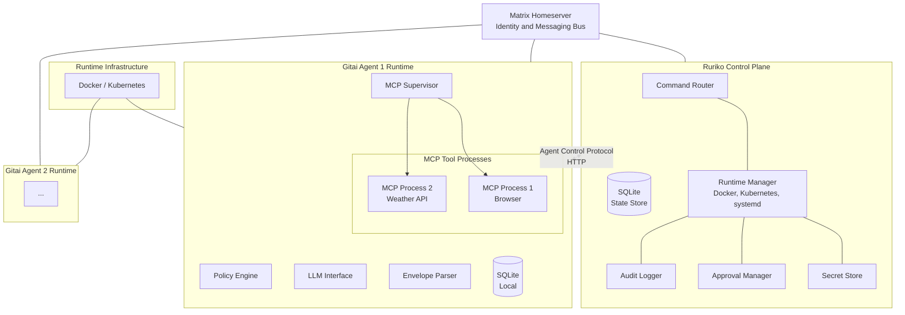
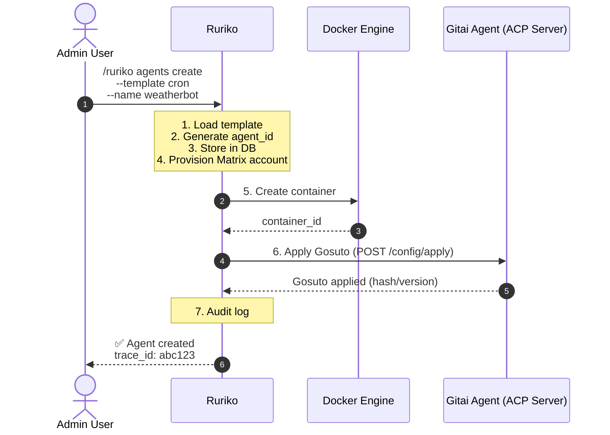
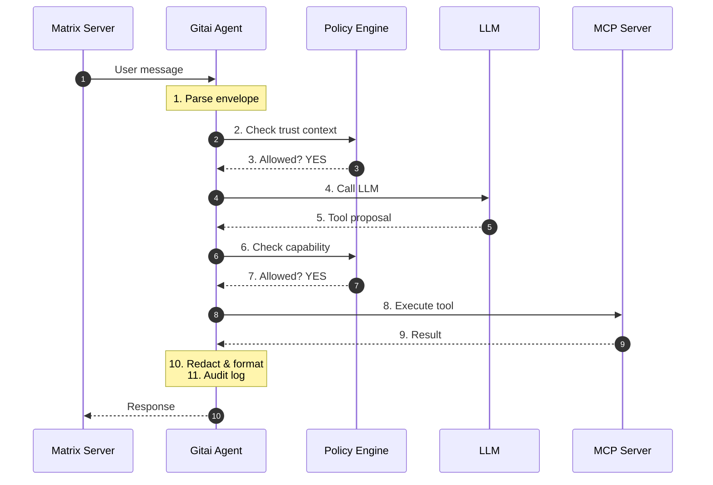
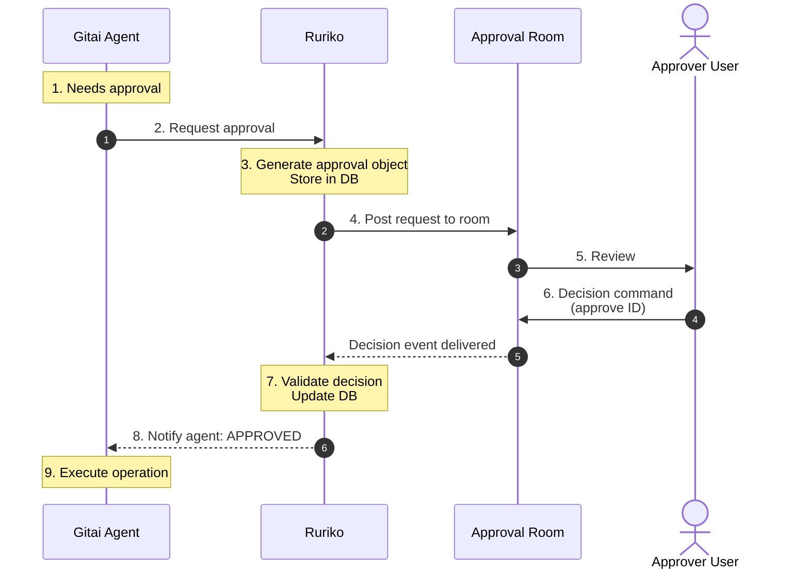

# Ruriko System Architecture

> **High-level architecture and component interactions**

**Version**: 0.1.0  
**Last Updated**: 2026-02-19  
**Status**: Living Document

> For the canonical product story, user UX contract, and full glossary see
> [preamble.md](./preamble.md).

---

## Table of Contents

1. [Overview](#overview)
2. [System Components](#system-components)
3. [Architecture Diagrams](#architecture-diagrams)
4. [Component Details](#component-details)
5. [Data Flow](#data-flow)
6. [Communication Protocols](#communication-protocols)
7. [Deployment Models](#deployment-models)

---

## Overview

Ruriko is a distributed control plane for managing secure, capability-scoped AI agents over Matrix. The system follows a **control plane + data plane** architecture:

- **Ruriko (Control Plane)**: Manages agent lifecycle, secrets, policy, and approvals
- **Gitai (Data Plane)**: Individual agent runtimes that execute under policy constraints

**Key Design Principles**:
- Separation of control logic from agent logic
- Centralized secrets and policy management
- Deterministic, non-LLM control decisions
- Defense in depth with multiple security layers

---

## System Components

### 1. Ruriko (Control Plane)

**Responsibilities**:
- Agent lifecycle management (create, start, stop, delete)
- Secrets storage, rotation, and distribution
- Gosuto (policy) versioning and application
- Matrix identity provisioning
- Approval workflow orchestration
- Audit logging and trace correlation
- Template management

**Key Subsystems**:
- Command Router: Deterministic Matrix command parser
- Runtime Adapters: Docker, Kubernetes, systemd
- Secret Store: Encrypted secrets with rotation
- Kuze: One-time link secret entry + agent secret token distribution
- Approval Engine: Workflow and decision tracking
- Agent Control Protocol (ACP) Client: HTTP client for agent management

**State Storage**:
- SQLite database (agent inventory, secrets, audit logs, approvals)
- Optional: Redis for caching (future)

---

### 2. Gitai (Agent Runtime)

**Responsibilities**:
- Matrix message handling and response
- Policy enforcement (Gosuto rules)
- LLM interaction (OpenAI, local models)
- MCP tool supervision and execution
- Approval request generation
- Local audit logging

**Key Subsystems**:
- Matrix Client: Message ingestion and sending
- Policy Engine: Capability-based authorization
- Envelope Parser: Structured agent-to-agent communication
- LLM Interface: Provider abstraction
- MCP Supervisor: Tool process lifecycle
- Agent Control Protocol Server: HTTP server for Ruriko commands

**State Storage**:
- SQLite database (local approvals cache, traces)
- In-memory: active Gosuto config, secrets, MCP processes

---

### 3. Gosuto (Configuration)

**Type**: Versioned YAML configuration

**Contents**:
- Trust contexts (allowed rooms, senders)
- Capability rules (what tools/actions are allowed)
- Constraints (rate limits, URL filters, payload sizes)
- Approval requirements
- MCP server definitions
- Persona and style (LLM prompt)

**Storage**: 
- Versioned in Ruriko's database
- Applied to agents via Agent Control Protocol
- Loaded into Gitai memory on startup/update

---

### 4. Matrix Homeserver

**Role**: Identity and messaging layer

**Responsibilities**:
- User and agent authentication
- Room management
- Message routing (E2EE optional)
- Presence and typing indicators

**Integration Points**:
- Ruriko connects as admin bot
- Agents connect as individual users
- Admin room for Ruriko commands
- Approval room for human decisions
- Optional audit room for transparency

---

### 5. MCP Servers (Tools)

**Role**: External tool capabilities

**Examples**:
- Browser automation (Playwright)
- Weather APIs
- File system access
- Database queries
- Custom enterprise connectors

**Integration**:
- Launched and supervised by Gitai
- Communicate via stdio or TCP
- Defined in Gosuto configuration
- Calls gated by policy engine

---

## Architecture Diagrams

### High-Level System Architecture



---

### Lifecycle: Agent Creation



---

### Lifecycle: Message Processing (Agent)



---

### Lifecycle: Approval Workflow



---

## Component Details

### Ruriko Subsystems

#### Command Router (`internal/ruriko/commands/`)
- Parses Matrix messages for `/ruriko` commands
- Validates command syntax and arguments
- Checks sender permissions
- Dispatches to appropriate handlers
- Generates trace IDs
- Returns structured responses

#### Runtime Manager (`internal/ruriko/runtime/`)
- Abstract interface for multiple runtimes (Docker, K8s, systemd)
- Handles agent container lifecycle
- Reconciliation loop (desired vs actual state)
- Health checking
- Resource management

#### Secret Store (`internal/ruriko/secrets/`)
- Encrypts secrets at rest (AES-GCM)
- Manages secret versioning and rotation
- Tracks agent-secret bindings
- Pushes updates to agents
- Audit logging for secret operations

#### Approval Manager (`internal/ruriko/approvals/`)
- Creates approval objects with TTL
- Stores in database
- Parses approval decisions
- Enforces approver lists
- Handles expiration

#### Agent Control Protocol Client (`internal/ruriko/runtime/acp/`)
- HTTP client for agent management
- Endpoints: /health, /status, /config/apply, /secrets/apply, /process/restart
- Optional mTLS support
- Request/response logging

---

### Gitai Subsystems

#### Policy Engine (`internal/gitai/policy/`)
- Evaluates trust contexts (room/sender allowlists)
- Evaluates capability rules
- Enforces constraints (rate limits, URL filters, payload sizes)
- Returns ALLOW / APPROVAL_REQUIRED / DENY decisions
- Pure, deterministic logic (no LLM)

#### LLM Interface (`internal/gitai/llm/`)
- Provider abstraction (OpenAI, Anthropic, local models)
- Handles tool proposal format
- Manages context windows
- Tracks token usage
- Retries and error handling

#### MCP Supervisor (`internal/gitai/supervisor/`)
- Starts/stops MCP processes based on Gosuto
- Monitors process health
- Restarts on crash with backoff
- Exposes status via /status endpoint
- Logs MCP stdout/stderr

#### Envelope Parser (`internal/gitai/envelope/`)
- Extracts JSON envelope from Matrix message
- Validates schema (version, structure)
- Verifies from/to/trace_id
- Handles request/response pairing
- Error handling for malformed envelopes

---

## Data Flow

### 1. Command Flow (Admin → Ruriko)

```
Admin types command in Matrix
    ↓
Matrix homeserver routes to Ruriko
    ↓
Ruriko's Matrix client receives event
    ↓
Command router parses and validates
    ↓
Permission check (sender allowlist)
    ↓
Handler executes operation
    ↓
Audit log written
    ↓
Response sent to Matrix
```

### 2. Message Flow (User → Agent)

```
User sends message in agent's room
    ↓
Matrix homeserver routes to Gitai
    ↓
Gitai's Matrix client receives event
    ↓
Policy engine checks trust context
    ↓
Envelope parser extracts request (if present)
    ↓
LLM processes message
    ↓
LLM proposes tool calls
    ↓
Policy engine validates each tool call
    ↓
MCP tools execute (if allowed)
    ↓
Results aggregated and redacted
    ↓
Response envelope generated
    ↓
Friendly message + envelope sent to Matrix
```

### 3. Gosuto Update Flow

```
Admin uploads new Gosuto to Ruriko
    ↓
Ruriko validates YAML schema
    ↓
Computes hash, stores as new version
    ↓
Sends to agent via ACP: POST /config/apply
    ↓
Gitai validates received Gosuto
    ↓
Atomic swap to new config
    ↓
Reports applied hash back to Ruriko
    ↓
Audit logged
```

---

## Communication Protocols

### 1. Matrix (Human ↔ Ruriko, Human ↔ Agent, Agent ↔ Agent)

**Protocol**: Matrix Client-Server API  
**Transport**: HTTPS (WebSocket for sync)  
**Authentication**: Access token  
**Message Format**: `m.room.message` events  

**Usage**:
- Admin commands to Ruriko
- User messages to agents
- Agent responses
- Agent-to-agent structured requests (envelope-based)
- Approval workflows

---

### 2. Agent Control Protocol (Ruriko ↔ Gitai)

**Protocol**: HTTP REST  
**Transport**: HTTP/1.1 (optional mTLS)  
**Authentication**: Bearer token or mTLS  
**Format**: JSON  

**Endpoints**:
- `GET /health` - Health check
- `GET /status` - Runtime status (version, gosuto hash, MCPs)
- `POST /config/apply` - Apply new Gosuto
- `POST /secrets/apply` - Push secrets update
- `POST /process/restart` - Graceful restart

---

### 3. MCP (Gitai ↔ MCP Servers)

**Protocol**: Model Context Protocol (stdio or TCP)  
**Transport**: stdin/stdout or TCP socket  
**Format**: JSON-RPC 2.0  

**Operations**:
- Tool discovery
- Tool invocation
- Result return

---

## Deployment Models

### 1. Docker Compose MVP (Tuwunel — Recommended)

```
services:
  tuwunel:         # lightweight, single-binary Matrix homeserver
    image: tuwunel:latest
    # Federation OFF, registration OFF

  ruriko:
    image: ruriko:latest
    volumes:
      - ./data:/data
    environment:
      - MATRIX_HOMESERVER=http://tuwunel:8008
      - RURIKO_MASTER_KEY=...

  agent-tim:
    image: gitai:latest
    environment:
      - GITAI_AGENT_ID=tim

  agent-warren:
    image: gitai:latest
    environment:
      - GITAI_AGENT_ID=warren
```

**Pros**: Single command (`docker compose up -d`), Tuwunel is lightweight and
private, ACP stays inside the Docker network  
**Cons**: Single host, no HA

> Kuze is embedded in Ruriko in this model. Secret entry is done via one-time
> browser links that Ruriko issues. Secrets never pass through Matrix.

---

### 2. Kubernetes (Production)

```
Deployment: ruriko (replicas: 1, persistent volume)
Deployment: gitai-agent-1 (replicas: 1)
Deployment: gitai-agent-2 (replicas: 1)
Service: ruriko-control (ClusterIP)
Service: agent-control (ClusterIP, headless)
ConfigMap: gosuto-configs
Secret: agent-secrets
```

**Pros**: HA, scaling, orchestration  
**Cons**: Complexity

---

### 3. Raspberry Pi / Homelab (Self-Hosted)

```
systemd services:
  - ruriko.service
  - gitai@weatherbot.service
  - gitai@browserbot.service
```

**Pros**: Low cost, full control  
**Cons**: Limited resources, manual management

---

## Security Boundaries

### Trust Boundaries

1. **Matrix Protocol Boundary**
   - All external input crosses here
   - Authentication and authorization required

2. **Control Plane Boundary**
   - Ruriko has elevated privileges
   - Only admins can send commands

3. **Agent Runtime Boundary**
   - Agents are sandboxed (container or process isolation)
   - Limited capabilities defined by Gosuto

4. **Tool Execution Boundary**
   - MCP tools run in separate processes
   - Results filtered and redacted

### Defense Layers

1. **Identity**: Matrix authentication
2. **Authorization**: Gosuto policy rules
3. **Validation**: Schema validation, constraint checking
4. **Isolation**: Container/process boundaries
5. **Audit**: All actions logged
6. **Approval**: Human checkpoints for risky operations

---

## Scalability Considerations

### Current Design (MVP)

- Ruriko: Single instance (SQLite)
- Agents: Multiple instances, independent
- Matrix: Tuwunel homeserver (local, single-host)

**Bottlenecks**:
- SQLite write concurrency
- Ruriko single point of failure

### Future Scaling

- **Ruriko HA**: Leader election (etcd, Consul)
- **Database**: PostgreSQL or distributed SQLite (LiteFS)
- **Agent-to-Agent**: Direct communication (no Ruriko hop)
- **Sharding**: Group agents by function/team

---

## References

- [preamble.md](./preamble.md) - Product story, UX contract, and canonical glossary
- [invariants.md](./invariants.md) - System invariants
- [threat-model.md](./threat-model.md) - Security analysis
- [gosuto-spec.md](./gosuto-spec.md) - Policy specification
- [agent-envelope-spec.md](./agent-envelope-spec.md) - Agent communication protocol
