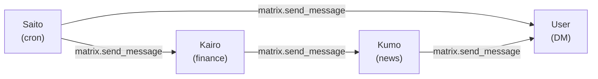

# Configuring Agent Mesh Topology

> **Phase**: R15 — Built-in Matrix Messaging Tool  
> **Invariant**: Inter-agent communication is policy-gated. Agents can only
> message rooms explicitly listed in their Gosuto `messaging.allowedTargets`.
> See [invariants.md §12](../invariants.md).

## Overview

In a Ruriko deployment each agent is an independent process that communicates
with other agents **directly over Matrix** — not through Ruriko as a relay.
The set of rooms an agent may message is called its **messaging topology** and
is defined at provision time inside the agent's Gosuto configuration.

The canonical three-agent mesh for the Saito → Kairo → Kumo workflow looks
like this:



Each arrow is a **permitted outbound message direction**, defined by
`messaging.allowedTargets` in the sending agent's Gosuto.

---

## The `messaging` Gosuto Section

```yaml
messaging:
  allowedTargets:
    - roomId: "!abc123:homeserver"   # full Matrix room ID (must start with !)
      alias: kairo                   # friendly alias used in LLM prompts + logs
    - roomId: "!xyz789:homeserver"
      alias: user
  maxMessagesPerMinute: 30           # rate limit (0 = unlimited)
```

| Field | Required | Description |
|-------|----------|-------------|
| `allowedTargets[].roomId` | yes | Full Matrix room ID. Must start with `!`. Filled at provision time by Ruriko. |
| `allowedTargets[].alias` | yes | Short, whitespace-free friendly name. Exposed to the LLM so it can name targets without knowing room IDs. |
| `maxMessagesPerMinute` | no | Outbound rate limit across all targets combined. Defaults to unlimited (0). |

**Default is deny-all**: if `messaging` is absent or `allowedTargets` is empty,
the `matrix.send_message` built-in tool is unavailable and the agent cannot
send messages to anyone.

---

## Capability Rule Requirement

Agents that use `matrix.send_message` must also have a capability rule that
permits it. Built-in tools live under the `builtin` pseudo-MCP namespace:

```yaml
capabilities:
  - name: allow-matrix-send
    mcp: builtin
    tool: matrix.send_message
    allow: true
```

Place this rule **before** any wildcard-deny rule. Without this rule the policy
engine will deny every `matrix.send_message` call regardless of the
`messaging.allowedTargets` list. Both the capability rule **and** the
`allowedTargets` entry must allow a target for a message to be sent — the
policy engine checks both.

---

## Canonical Agent Topology

The canonical Saito → Kairo → Kumo mesh uses the following topology:

| Agent | Allowed targets | Purpose |
|-------|----------------|---------|
| **Saito** | `kairo`, `user` | Notifies Kairo to start an analysis cycle; escalates to the user if needed |
| **Kairo** | `kumo`, `user` | Asks Kumo for news context; delivers final reports to the user |
| **Kumo** | `kairo`, `user` | Returns news summaries to Kairo; contacts user only if explicitly instructed |

### Template Variables

The canonical templates (`saito-agent`, `kairo-agent`, `kumo-agent`) use Go
template variables for room IDs. Ruriko populates these at provision time from
its agent inventory:

| Variable | Meaning |
|----------|---------|
| `{{.KairoAdminRoom}}` | Admin room ID for the Kairo agent |
| `{{.KumoAdminRoom}}` | Admin room ID for the Kumo agent |
| `{{.UserRoom}}` | Matrix DM room ID for the human operator |

These are members of `templates.TemplateVars` in
`internal/ruriko/templates/loader.go`. Ruriko's provisioning pipeline
(R15.4) resolves the room IDs from its agent inventory and passes them to the
template renderer before applying the Gosuto via ACP.

---

## Setting Up the Mesh Manually

If you are provisioning agents manually (i.e. not via the NLP wizard), look up
each agent's admin room from Ruriko's agent list and substitute the room IDs
directly:

```bash
# 1. Find each agent's admin room
/ruriko agents list

# 2. Edit the Gosuto for saito with the correct room IDs
/ruriko gosuto edit saito
```

Replace the placeholder room IDs in `messaging.allowedTargets` with the real
values from step 1, then apply:

```bash
/ruriko gosuto apply saito
```

Ruriko validates the updated Gosuto (including the messaging section) before
pushing it to the agent via ACP.

---

## Provision-Time Peer Overrides (Operator Commands)

For templates that expose peer placeholders (for example `kumo-agent`), you
can set the peer topology directly at creation time using deterministic flags on
`/ruriko agents create`.

Supported flags:

- `--peer-alias`: friendly peer alias used in trusted peer lists and prompts
- `--peer-mxid`: peer Matrix user ID (must start with `@`)
- `--peer-room`: peer Matrix room ID (must start with `!`)
- `--peer-protocol-id`: expected envelope protocol ID
- `--peer-protocol-prefix`: expected envelope payload prefix

### Example: Kumo wired to Marketbot (non-canonical topology)

```bash
/ruriko agents create \
  --name kumo-marketbot \
  --template kumo-agent \
  --image gitai:latest \
  --peer-alias marketbot \
  --peer-mxid @marketbot:localhost \
  --peer-room '!marketbot-admin:localhost' \
  --peer-protocol-id marketbot.news.request.v1 \
  --peer-protocol-prefix MARKETBOT_NEWS_REQUEST
```

### Example: Same peer identity, different room routing

```bash
/ruriko agents create \
  --name kumo-kairo-altroom \
  --template kumo-agent \
  --image gitai:latest \
  --peer-alias kairo \
  --peer-mxid @kairo:localhost \
  --peer-room '!kairo-alt-admin:localhost' \
  --peer-protocol-id kairo.news.request.v1 \
  --peer-protocol-prefix KAIRO_NEWS_REQUEST
```

### Validation behavior

- `--peer-alias` must be non-empty.
- `--peer-mxid` must start with `@`.
- `--peer-room` is optional but, when set, must start with `!`.
- `--peer-protocol-id` and `--peer-protocol-prefix` must be non-empty.

If optional peer flags are omitted, Ruriko applies deterministic defaults.
Use explicit values when operating multi-peer or non-canonical meshes so the
topology contract is visible in command history and audit logs.

---

## Post-Provision Ensure-If-Missing (Operator Commands)

For existing agents, use `topology peer-ensure` to add required peer trust +
messaging entries only when they are missing.

This is intentionally different from `topology peer-set`:

- `peer-ensure` is add-only and idempotent (no-op when already satisfied)
- `peer-set` is update-capable (can rewrite existing mappings)

Command form:

```bash
/ruriko topology peer-ensure <agent> \
  --alias <alias> \
  --mxid <mxid> \
  --room <room-id> \
  --protocol <id> \
  [--target-room <room-id>] \
  [--push true|false]
```

### Example: ensure Marketbot mapping on an existing Kumo agent

```bash
/ruriko topology peer-ensure kumo-marketbot \
  --alias marketbot \
  --mxid @marketbot:localhost \
  --room '!marketbot-admin:localhost' \
  --protocol marketbot.news.request.v1 \
  --push true
```

### Example: ensure Kairo trust with dedicated outbound target room

```bash
/ruriko topology peer-ensure kumo-kairo-altroom \
  --alias kairo \
  --mxid @kairo:localhost \
  --room '!kairo-admin:localhost' \
  --protocol kairo.news.request.v1 \
  --target-room '!kairo-dispatch:localhost'
```

### Validation and safety behavior

- `--alias` must be non-empty and whitespace-free.
- `--mxid` must start with `@`.
- `--room` and `--target-room` must start with `!`.
- If alias already maps to different MXID/room data, command refuses with a
  deterministic conflict error instead of rewriting.
- Widening changes are approval-gated and fully audited.
- `--push true` triggers ACP apply attempt after versioning; apply failure does
  not roll back stored config versions.

---

## Security Notes

1. **Topology is versioned**: every change to `messaging.allowedTargets` is
   recorded as a new Gosuto version with a content hash, making the mesh
   configuration auditable and diffable.

2. **Rate limiting**: set `maxMessagesPerMinute` to prevent runaway loops. The
   canonical agents use 10 msg/min (Saito) and 30 msg/min (Kairo, Kumo).

3. **No peer discovery at runtime**: agents cannot look up other agents'
   room IDs or add new targets without a Gosuto update pushed by Ruriko.
   The mesh topology is static configuration, not runtime negotiation.

4. **Audit breadcrumbs**: every `matrix.send_message` call is logged at INFO
   (source agent, target alias, target room ID, trace ID) and posted as a
   breadcrumb to the admin room: `📨 Sent message to kairo (trace=…)`.
   Message content is only logged at DEBUG level with redaction applied.

---

## Troubleshooting

| Symptom | Likely cause |
|---------|-------------|
| `matrix.send_message` tool not visible to LLM | No `allow-matrix-send` capability rule, or `messaging.allowedTargets` is empty |
| `target "kumo" not in allowed targets` error | The alias used by the LLM does not match any entry in `allowedTargets` |
| Rate limit errors from Kumo | Kairo's `maxMessagesPerMinute` too low for the workload |
| Messages arrive in wrong room | Room IDs were swapped at provision time — check `messaging.allowedTargets` via `/ruriko gosuto show <agent>` |
